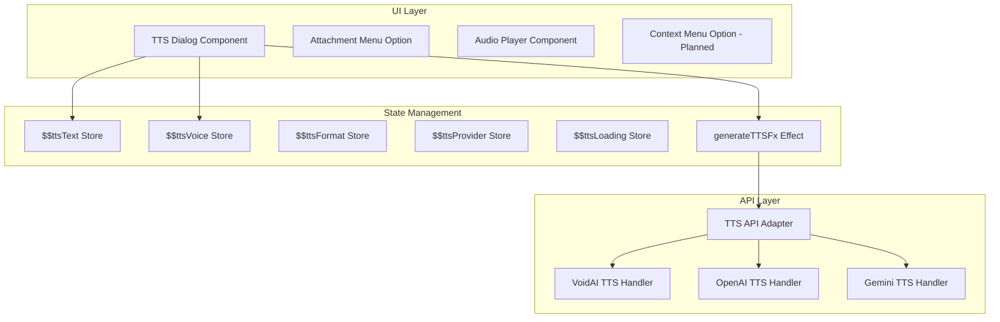
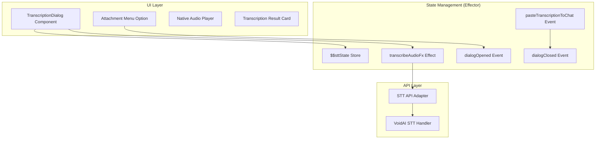
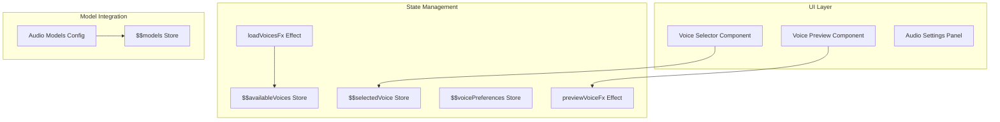
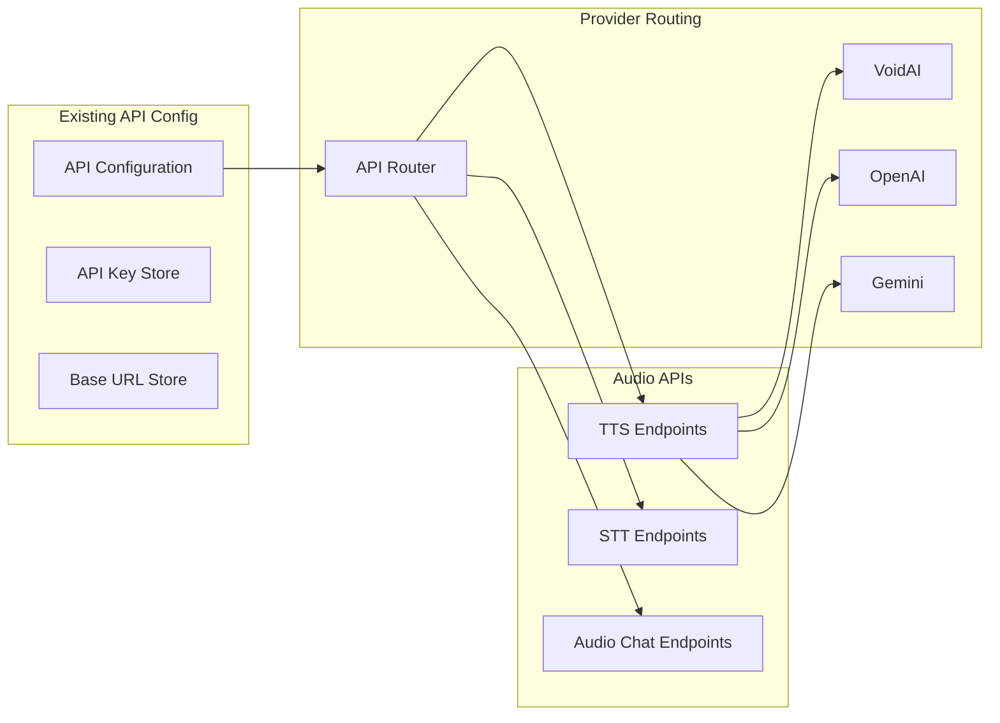

# Audio Features Integration Plan

## 1. Introduction and Overview

This document outlines the comprehensive architectural plan for integrating
audio features into our existing chat application. The plan covers four main
audio capabilities while maintaining our multi-provider architecture (VoidAI,
OpenAI, and Gemini).

### 1.1 Scope

The audio integration will add the following features:

1. **Text-to-Speech (TTS)**: Convert user-specified text into downloadable audio
   files
2. **Speech-to-Text (STT)**: Transcribe uploaded audio files into text
3. **Audio Input/Output**: Support audio messages within chat conversations
4. **Voice Model Selection**: Choose different voice models and configurations

### 1.2 Architecture Principles

- **Feature-based structure**: Each audio feature will be a self-contained
  module
- **Provider abstraction**: Handle API differences between providers
  transparently
- **State management**: Use Effector for predictable state updates
- **User-centric design**: Clear UI/UX for audio interactions

## 2. Text-to-Speech (TTS) Feature

### 2.1 User Experience

Users can convert any text to audio through:

- A dedicated TTS dialog accessible via attachment menu (📎 → "Text to Speech")
  ✅ Implemented
- Text selection with right-click context menu option ❌ Not implemented
- Keyboard shortcut (Ctrl/Cmd + Shift + S) ❌ Not implemented

The TTS dialog includes:

- Text input area with character counter (4000 max) ✅
- TTS model selector dropdown with provider information ✅
- Voice selector dropdown (dynamic based on model) ✅
- Audio format selector (filtered by model capabilities) ✅
- Instructions field (only for gpt-4o-mini-tts model) ✅
- Streaming toggle switch ✅
- Generated audio history with playback and download ✅
- Delete audio functionality ✅
- Speed control ❌ Not implemented in UI (store exists)

### 2.2 Architecture



### 2.3 Provider Capabilities Matrix (Implemented)

| Feature          | VoidAI                                                                                              | Gemini                                                   |
| ---------------- | --------------------------------------------------------------------------------------------------- | -------------------------------------------------------- |
| Voices           | alloy, ash, ballad, coral, echo, fable, onyx, nova, sage, shimmer, verse                            | 30+ voices (Aoede, Charon, Circe, Kore, Fenrir, etc.)    |
| Formats          | MP3, OPUS, AAC, FLAC, WAV, PCM (varies by model)                                                    | WAV only                                                 |
| Models           | tts-1, tts-1-hd, gpt-4o-mini-tts, elevenlabs, gpt-4o-audio-preview, gpt-4o-audio-preview-2024-12-17 | gemini-2.5-flash-preview-tts, gemini-2.5-pro-preview-tts |
| API Endpoint     | /audio/speech (except gpt-4o-audio models use /chat/completions)                                    | /audio/speech (hybrid format)                            |
| Instructions     | ✅ Supported (gpt-4o-mini-tts only)                                                                 | ❌ Not supported                                         |
| Speed Control    | 0.25-4.0 (tts-1, tts-1-hd only)                                                                     | ❌ Not supported                                         |
| Multi-speaker    | ❌ Not implemented                                                                                  | ❌ Not implemented (single speaker only)                 |
| Special Features | ElevenLabs: emotion & accent control, GPT-4o-mini: voice instructions                               | Hybrid API format support                                |

### 2.4 State Model (Actual Implementation)

```typescript
// Features/text-to-speech/model.ts actual structure
interface TTSState {
  text: string
  selectedModel: string
  selectedVoice: string
  selectedFormat: AudioFormat
  isLoading: boolean
  error: string | null
  availableVoices: VoiceOption[]
  instructions: string // For gpt-4o-mini-tts
  audioUrl: string | null
}

// Model Preferences (persisted)
interface ModelPreferences {
  [modelId: string]: {
    voice: string
    format: AudioFormat
    speed: number
    instructions?: string
  }
}

// Generated Audio Storage
interface GeneratedAudio {
  id: string
  url: string
  text: string
  model: string
  voice: string
  format: AudioFormat
  size: number
  timestamp: number
  filename: string
}

// Events
- textChanged: Update text to convert
- voiceSelected: Change voice option
- formatSelected: Change output format
- modelSelected: Change TTS model (updates voice options)
- instructionsChanged: Update voice instructions
- generateTTSClicked: Regular TTS generation
- generateTTSStreamClicked: Streaming TTS (falls back to regular)
- downloadRequested: Save audio file
- previewRequested: Play audio preview
- deleteAudio: Remove from history
- clearError: Clear error message
- ttsDialogOpened: Initialize dialog
- ttsDialogClosed: Cleanup dialog

// Effects
- generateTTSFx: Call provider API with hybrid format for Gemini
- generateTTSStreamFx: Attempt streaming (falls back)
- loadModelPreferencesFx: Load saved preferences
- saveModelPreferencesFx: Persist preferences
```

## 3. Speech-to-Text (STT) Feature

### 3.1 User Experience (Actual Implementation)

Users can transcribe audio files via a dedicated **Standalone Transcription
Dialog**, which provides a comprehensive and robust user experience.

- **Access Point**: The dialog is opened via the attachment menu (📎 →
  "Transcribe Audio").
- **File Input & Analysis**:
  - Supports drag-and-drop and a standard file picker.
  - Enforces a 25MB file size limit and validates file types (`mp3`, `mp4`,
    `wav`, etc.).
  - **Client-Side Analysis**: Before transcription, the UI displays the audio
    file's **size, format, duration, and sample rate**.
  - **Audio Preview**: An integrated HTML `<audio>` player allows users to
    preview the uploaded file.
- **Transcription Configuration**:
  - **Model Selection**: Dropdown to choose between `whisper-1`,
    `gpt-4o-mini-transcribe`, etc.
  - **Response Format**: Users can select the output format (`json`, `text`,
    `srt`, `vtt`, `verbose_json`), with options dynamically filtered based on
    model compatibility. Preferences are saved to `localStorage` on a per-model
    basis.
  - **Context Prompt**: A text area allows users to provide hints and jargon to
    improve accuracy.
- **Process & Results**:
  - A loading indicator is shown during transcription.
  - The dialog displays a history of completed transcriptions.
  - **Result Cards**: Each card shows the **audio duration**, the size of the
    **generated text**, and the raw API response (e.g., JSON, SRT).
  - **Actions**: Users can **download** the raw response, **copy** the text, or
    **paste the text** into the main chat input, which then closes the dialog.

### 3.2 Architecture (Actual Implementation)

The architecture follows a modular, feature-based structure, mirroring the TTS
implementation.



### 3.3 Provider Capabilities Matrix (Actual Implementation)

| Feature          | VoidAI (OpenAI Compatible)                                       |
| ---------------- | ---------------------------------------------------------------- |
| Models           | `whisper-1`, `gpt-4o-transcribe`, `gpt-4o-mini-transcribe`       |
| Streaming        | ❌ Not implemented                                               |
| Translation      | ❌ Not implemented (scoped out)                                  |
| Response Formats | `json`, `text`, `srt`, `vtt`, `verbose_json` (filtered by model) |
| Max File Size    | 25MB (enforced client-side)                                      |

### 3.4 State Model (Actual Implementation)

The Effector state model in `features/speech-to-text/model.ts` manages the
entire feature lifecycle.

```typescript
// features/speech-to-text/types.ts
export interface TranscriptionResult {
  id: string;
  text: string;
  rawResponse: string;
  fileName: string;
  fileSize: number;
  audioDuration?: number; // Duration in seconds
  textSize: number; // Size of transcribed text in bytes
  model: string;
  prompt?: string;
  timestamp: number;
  responseFormat: ResponseFormat;
}

export interface STTState {
  isDialogOpen: boolean;
  file: File | null;
  audioDuration?: number;
  selectedModel: string;
  prompt: string;
  isLoading: boolean;
  validationError: string | null;
  transcriptionHistory: TranscriptionResult[];
  // ...and more
}

// features/speech-to-text/model.ts
// Events
- dialogOpened: Triggered to show the dialog.
- dialogClosed: Triggered to hide the dialog.
- fileSelected: Handles new file input and validation.
- modelChanged: Updates the selected transcription model.
- responseFormatChanged: Updates and persists the selected format.
- pasteTranscriptionToChat: Pastes text to chat input and closes the dialog.

// Effects
- transcribeAudioFx: Manages the `multipart/form-data` API call to VoidAI.
- loadTranscriptionHistoryFx: Loads past results from localStorage.
- saveTranscriptionFx: Saves a new result to localStorage.
```

## 4. Audio Input/Output in Chat (Phase 4: Integrated Audio Chat)

### 4.1 User Experience

This phase integrates audio capabilities directly into chat messages, providing
ephemeral, on-demand transcription and text-to-speech without affecting the
persistent chat history.

#### 4.1.1 In-Message Text-to-Speech (TTS)

**Purpose**: Allow users to hear any text message read aloud using their
preferred voice model.

**UI Implementation**:

- **Speaker Icon**: Every text-based message (user and assistant) displays a
  clickable speaker icon (🔊) in the message action toolbar
- **Toggle Behavior**: The speaker icon acts as a toggle button:
  - **Inactive State**: Shows as 🔊 (gray/muted color)
  - **Loading State**: Shows spinner while generating audio
  - **Active State**: Shows as 🔊 (highlighted/accent color) when audio player
    is visible
- **Audio Player**: When activated, a temporary inline audio player appears
  directly below the text message
- **Player Controls**: Native HTML5 audio controls with play/pause, progress
  bar, volume, download, and speed control

**User Flow**:

1. User clicks speaker icon on any text message
2. System uses the pre-configured "In-Chat TTS Model" to generate audio from the
   message text
3. Loading indicator appears on the speaker icon
4. Generated audio player appears below the message with native controls
5. User can toggle the player visibility by clicking the speaker icon again
6. Audio is cached temporarily for the session (not persisted)

#### 4.1.2 In-Message Transcription (STT)

**Purpose**: Allow users to get text transcripts of audio messages using their
preferred transcription model.

**UI Implementation**:

- **Transcribe Button**: Every audio message displays a "Transcribe" button (📝)
  in the message action toolbar
- **Toggle Behavior**: The transcribe button acts as a toggle:
  - **Inactive State**: Shows as "Transcribe" (📝)
  - **Loading State**: Shows spinner while transcribing
  - **Active State**: Shows as "Hide Transcript" when transcript is visible
- **Transcript Display**: When activated, a temporary text block appears
  directly below the audio player
- **Visual Distinction**: Transcript text has different styling (dashed border,
  muted background, "Temporary" badge)

**User Flow**:

1. User clicks "Transcribe" button on any audio message
2. System uses the pre-configured "In-Chat Transcription Model" to transcribe
   the audio
3. Loading indicator appears on the transcribe button
4. Generated transcript appears below the audio player in a styled text block
5. User can toggle transcript visibility by clicking the button again
6. Transcript is cached temporarily for the session (not persisted)

#### 4.1.3 Chat Settings Integration

**New Model Selectors**: Two dedicated dropdowns added to the Chat Settings
sidebar:

1. **In-Chat TTS Model**:

   - Dropdown selector for choosing the TTS model used for in-message audio
     generation
   - Filtered to show only TTS-capable models ("/v1/audio/speech" endpoint)
   - Persisted to localStorage as `inChatTtsModel`
   - Default: `tts-1-hd`

2. **In-Chat Transcription Model**:
   - Dropdown selector for choosing the STT model used for in-message
     transcription
   - Filtered to show only STT-capable models ("/v1/audio/transcriptions"
     endpoint and models with "audio" in the name)
   - Persisted to localStorage as `inChatTranscriptionModel`
   - Default: `whisper-1`

#### 4.1.4 Visual Design Principles

**Ephemeral Content Indication**:

- Generated audio players and transcripts are visually distinct from permanent
  content
- Use dashed borders, muted background colors, or subtle "Temporary" badges
  (choose what you think is right)
- Different color scheme, if needed (e.g., blue-gray instead of primary colors)

**Message Layout**:

```
┌─────────────────────────────────────────────────────────┐
│ Assistant:                                              │
│ This is a sample text message that can be converted     │
│ to audio using the speaker icon.                        │
│                                                         │
│ [💬] [📋] [🔊] [✏️] [🗑️]                                │
│                                                         │
│ ┌─ ─ ─ ─ ─ ─ ─ ─ ─ ─ ─ ─ ─ ─ ─ ─ ─ ─ ─ ─ ─ ─ ─ ─ ─ ─┐ │
│ ┊ 🎵 Generated Audio (Temporary)                     ┊ │
│ ┊ [▶️] ━━━━━━━━────────────── 0:05/0:12             ┊ │
│ ┊ [1x ▼] [📥]                                       ┊ │
│ └ ─ ─ ─ ─ ─ ─ ─ ─ ─ ─ ─ ─ ─ ─ ─ ─ ─ ─ ─ ─ ─ ─ ─ ─ ─ ─┘ │
└─────────────────────────────────────────────────────────┘

┌─────────────────────────────────────────────────────────┐
│ User:                                                   │
│ [🎵 Audio Message (0:45)]                               │
│ [▶️] ━━━━━━━━────────────── 0:12/0:45                   │
│ [1x ▼] [📥] [📝] [✏️] [🗑️]                              │
│                                                         │
│ ┌─ ─ ─ ─ ─ ─ ─ ─ ─ ─ ─ ─ ─ ─ ─ ─ ─ ─ ─ ─ ─ ─ ─ ─ ─ ─┐ │
│ ┊ 📝 Transcript (Temporary)                          ┊ │
│ ┊ "Hello, this is my audio message. I wanted to      ┊ │
│ ┊ ask you about the integration plan..."             ┊ │
│ └ ─ ─ ─ ─ ─ ─ ─ ─ ─ ─ ─ ─ ─ ─ ─ ─ ─ ─ ─ ─ ─ ─ ─ ─ ─ ─┘ │
└─────────────────────────────────────────────────────────┘
```

### 4.2 Architecture

The architecture maintains strict separation between persistent chat data and
ephemeral audio enhancements, ensuring temporary content never pollutes the chat
history or API calls.

```mermaid
graph TB
    subgraph "UI Layer - Message Components"
        MessageItem[MessageItem Component]
        TextMessage[Text Message Display]
        AudioMessage[Audio Message Display]
        SpeakerIcon[Speaker Icon Button]
        TranscribeButton[Transcribe Button]
        EphemeralAudioPlayer[Ephemeral Audio Player]
        EphemeralTranscript[Ephemeral Transcript]
    end

    subgraph "Ephemeral State Management"
        $ephemeralData[$$ephemeralMessageData Store]
        $inChatTtsModel[$$inChatTtsModel Store]
        $inChatTranscriptionModel[$$inChatTranscriptionModel Store]

        generateInMessageTTSFx[generateInMessageTTSFx Effect]
        generateInMessageSTTFx[generateInMessageSTTFx Effect]

        toggleMessageAudio[toggleMessageAudio Event]
        toggleMessageTranscript[toggleMessageTranscript Event]
        clearEphemeralData[clearEphemeralData Event]
    end

    subgraph "Chat Settings Integration"
        ChatSettings[Chat Settings Panel]
        TTSModelSelector[In-Chat TTS Model Selector]
        STTModelSelector[In-Chat STT Model Selector]
        LocalStoragePrefs[localStorage Preferences]
    end

    subgraph "API Layer Reuse"
        TTSAdapter[TTS API Adapter - Reused]
        STTAdapter[STT API Adapter - Reused]
        VoidAITTS[VoidAI TTS Handler]
        VoidAISTT[VoidAI STT Handler]
    end

    subgraph "Persistent Chat Data"
        $messages[$$messages Store - Unchanged]
        ChatHistory[Chat History - Unchanged]
        MessageContent[Message Content - Unchanged]
    end

    %% UI Interactions
    MessageItem --> TextMessage
    MessageItem --> AudioMessage
    TextMessage --> SpeakerIcon
    AudioMessage --> TranscribeButton

    %% Ephemeral State Flow
    SpeakerIcon --> toggleMessageAudio
    TranscribeButton --> toggleMessageTranscript
    toggleMessageAudio --> $ephemeralData
    toggleMessageTranscript --> $ephemeralData

    %% API Effects
    toggleMessageAudio --> generateInMessageTTSFx
    toggleMessageTranscript --> generateInMessageSTTFx
    generateInMessageTTSFx --> TTSAdapter
    generateInMessageSTTFx --> STTAdapter

    %% Settings Integration
    ChatSettings --> TTSModelSelector
    ChatSettings --> STTModelSelector
    TTSModelSelector --> $inChatTtsModel
    STTModelSelector --> $inChatTranscriptionModel
    $inChatTtsModel --> LocalStoragePrefs
    $inChatTranscriptionModel --> LocalStoragePrefs

    %% Model Selection for Effects
    $inChatTtsModel --> generateInMessageTTSFx
    $inChatTranscriptionModel --> generateInMessageSTTFx

    %% API Reuse
    TTSAdapter --> VoidAITTS
    STTAdapter --> VoidAISTT

    %% Ephemeral Display
    $ephemeralData --> EphemeralAudioPlayer
    $ephemeralData --> EphemeralTranscript

    %% Critical: No Connection to Persistent Data
    $ephemeralData -.x $messages
    $ephemeralData -.x ChatHistory
    EphemeralAudioPlayer -.x MessageContent
    EphemeralTranscript -.x MessageContent

    %% Styling
    classDef ephemeral fill:#e3f2fd,stroke:#1976d2,stroke-dasharray: 5 5
    classDef persistent fill:#f3e5f5,stroke:#7b1fa2
    classDef api fill:#e8f5e8,stroke:#388e3c
    classDef settings fill:#fff3e0,stroke:#f57c00

    class $ephemeralData,EphemeralAudioPlayer,EphemeralTranscript,generateInMessageTTSFx,generateInMessageSTTFx ephemeral
    class $messages,ChatHistory,MessageContent persistent
    class TTSAdapter,STTAdapter,VoidAITTS,VoidAISTT api
    class ChatSettings,TTSModelSelector,STTModelSelector,LocalStoragePrefs settings
```

### 4.3 State Model

#### 4.3.1 Ephemeral Data Store

The core state management uses a dedicated Effector store that is completely
separate from the persistent chat data:

```typescript
// src/features/audio-chat/types.ts
interface EphemeralMessageData {
  [messageId: string]: {
    audio?: {
      url: string;
      isLoading: boolean;
      isVisible: boolean;
      model: string;
      voice: string;
      timestamp: number;
    };
    transcript?: {
      text: string;
      isLoading: boolean;
      isVisible: boolean;
      model: string;
      format: string;
      timestamp: number;
    };
  };
}

interface InChatSettings {
  ttsModel: string;
  transcriptionModel: string;
}

// src/features/audio-chat/model.ts
const $ephemeralMessageData = createStore<EphemeralMessageData>({});
const $inChatTtsModel = createStore<string>('tts-1-hd');
const $inChatTranscriptionModel = createStore<string>('whisper-1');

// Public Events
const toggleMessageAudio = createEvent<{
  messageId: string;
  messageText: string;
}>();
const toggleMessageTranscript = createEvent<{
  messageId: string;
  audioUrl: string;
}>();
const clearEphemeralData = createEvent<string>(); // Clear data for specific message
const clearAllEphemeralData = createEvent<void>(); // Clear all temporary data

// Internal Events
const audioGenerationStarted = createEvent<{
  messageId: string;
  model: string;
}>();
const audioGenerationCompleted = createEvent<{
  messageId: string;
  audioUrl: string;
}>();
const audioGenerationFailed = createEvent<{
  messageId: string;
  error: string;
}>();
const transcriptionStarted = createEvent<{
  messageId: string;
  model: string;
}>();
const transcriptionCompleted = createEvent<{
  messageId: string;
  transcript: string;
  format: string;
}>();
const transcriptionFailed = createEvent<{ messageId: string; error: string }>();

// Effects
const generateInMessageTTSFx = createEffect<
  { messageId: string; text: string; model: string },
  { messageId: string; audioUrl: string }
>();

const generateInMessageSTTFx = createEffect<
  { messageId: string; audioUrl: string; model: string },
  { messageId: string; transcript: string; format: string }
>();

// Settings Effects
const loadInChatSettingsFx = createEffect<void, InChatSettings>();
const saveInChatTtsModelFx = createEffect<string, void>();
const saveInChatTranscriptionModelFx = createEffect<string, void>();
```

#### 4.3.2 State Flow Logic

```typescript
// Toggle TTS Audio for Text Messages
sample({
  clock: toggleMessageAudio,
  source: [$ephemeralMessageData, $inChatTtsModel],
  fn: ([ephemeralData, ttsModel], { messageId, messageText }) => {
    const currentData = ephemeralData[messageId]?.audio;

    if (currentData?.isVisible) {
      // Hide existing audio
      return { messageId, action: 'hide' as const };
    } else if (currentData?.url) {
      // Show existing audio
      return { messageId, action: 'show' as const };
    } else {
      // Generate new audio
      return {
        messageId,
        action: 'generate' as const,
        text: messageText,
        model: ttsModel,
      };
    }
  },
  target: [audioToggleProcessor],
});

// Process audio toggle actions
sample({
  clock: audioToggleProcessor,
  filter: (action) => action.action === 'generate',
  fn: ({ messageId, text, model }) => ({ messageId, text, model }),
  target: generateInMessageTTSFx,
});

// Toggle STT Transcript for Audio Messages
sample({
  clock: toggleMessageTranscript,
  source: [$ephemeralMessageData, $inChatTranscriptionModel],
  fn: ([ephemeralData, sttModel], { messageId, audioUrl }) => {
    const currentData = ephemeralData[messageId]?.transcript;

    if (currentData?.isVisible) {
      return { messageId, action: 'hide' as const };
    } else if (currentData?.text) {
      return { messageId, action: 'show' as const };
    } else {
      return {
        messageId,
        action: 'generate' as const,
        audioUrl,
        model: sttModel,
      };
    }
  },
  target: [transcriptToggleProcessor],
});

// Update ephemeral store for TTS completion
sample({
  clock: audioGenerationCompleted,
  source: $ephemeralMessageData,
  fn: (ephemeralData, { messageId, audioUrl }) => ({
    ...ephemeralData,
    [messageId]: {
      ...ephemeralData[messageId],
      audio: {
        url: audioUrl,
        isLoading: false,
        isVisible: true,
        model: 'current-model', // From context
        voice: 'current-voice', // From context
        timestamp: Date.now(),
      },
    },
  }),
  target: $ephemeralMessageData,
});

// Update ephemeral store for STT completion
sample({
  clock: transcriptionCompleted,
  source: $ephemeralMessageData,
  fn: (ephemeralData, { messageId, transcript, format }) => ({
    ...ephemeralData,
    [messageId]: {
      ...ephemeralData[messageId],
      transcript: {
        text: transcript,
        isLoading: false,
        isVisible: true,
        model: 'current-model', // From context
        format,
        timestamp: Date.now(),
      },
    },
  }),
  target: $ephemeralMessageData,
});
```

### 4.4 Implementation Strategy

#### 4.4.1 Component Integration

**MessageItem Component Updates**:

```typescript
// src/components/MessageItem.tsx additions
const EphemeralAudioPlayer = ({ messageId, audioData }) => {
  if (!audioData?.isVisible) return null;

  return (
    <Box
      sx={{
        border: "1px dashed #ccc",
        borderRadius: 1,
        p: 1,
        mt: 1,
        backgroundColor: "#f8f9fa",
        position: "relative",
      }}
    >
      <Typography variant="caption" color="text.secondary">
        🎵 Generated Audio (Temporary)
      </Typography>
      <audio controls src={audioData.url} style={{ width: "100%", mt: 1 }} />
    </Box>
  );
};

const EphemeralTranscript = ({ messageId, transcriptData }) => {
  if (!transcriptData?.isVisible) return null;

  return (
    <Box
      sx={{
        border: "1px dashed #ccc",
        borderRadius: 1,
        p: 1,
        mt: 1,
        backgroundColor: "#f0f4f8",
        fontStyle: "italic",
      }}
    >
      <Typography variant="caption" color="text.secondary">
        📝 Transcript (Temporary)
      </Typography>
      <Typography variant="body2" sx={{ mt: 1 }}>
        "{transcriptData.text}"
      </Typography>
    </Box>
  );
};
```

**Settings Panel Updates**:

```typescript
// src/components/ChatSettings.tsx additions
<FormControl fullWidth sx={{ mb: 2 }}>
  <InputLabel>In-Chat TTS Model</InputLabel>
  <Select
    value={inChatTtsModel}
    onChange={handleTtsModelChange}
    label="In-Chat TTS Model"
  >
    {ttsModels.map((model) => (
      <MenuItem key={model.id} value={model.id}>
        {model.name}
      </MenuItem>
    ))}
  </Select>
</FormControl>

<FormControl fullWidth sx={{ mb: 2 }}>
  <InputLabel>In-Chat Transcription Model</InputLabel>
  <Select
    value={inChatTranscriptionModel}
    onChange={handleSTTModelChange}
    label="In-Chat Transcription Model"
  >
    {sttModels.map((model) => (
      <MenuItem key={model.id} value={model.id}>
        {model.name}
      </MenuItem>
    ))}
  </Select>
</FormControl>
```

#### 4.4.2 API Integration

The implementation reuses existing TTS and STT API adapters from Phases 2 and 3:

```typescript
// src/features/audio-chat/model.ts
generateInMessageTTSFx.use(async ({ messageId, text, model }) => {
  // Reuse TTS API from src/features/text-to-speech/api.ts
  const audioBlob = await generateTTSAPI({
    text,
    model,
    voice: getDefaultVoiceForModel(model),
    format: 'mp3',
  });

  const audioUrl = URL.createObjectURL(audioBlob);
  return { messageId, audioUrl };
});

generateInMessageSTTFx.use(async ({ messageId, audioUrl, model }) => {
  // Convert URL to File for STT API
  const response = await fetch(audioUrl);
  const audioBlob = await response.blob();
  const audioFile = new File([audioBlob], 'audio.mp3', { type: 'audio/mp3' });

  // Reuse STT API from src/features/speech-to-text/api.ts
  const result = await transcribeAudioAPI({
    file: audioFile,
    model,
    responseFormat: 'text',
  });

  return { messageId, transcript: result.text, format: 'text' };
});
```

#### 4.4.3 Memory Management

**Critical**: Proper cleanup of temporary audio URLs to prevent memory leaks:

```typescript
// Cleanup when component unmounts or chat changes
const cleanupEphemeralData = createEvent<void>();

sample({
  clock: cleanupEphemeralData,
  source: $ephemeralMessageData,
  fn: (ephemeralData) => {
    // Revoke all blob URLs
    Object.values(ephemeralData).forEach((messageData) => {
      if (messageData.audio?.url) {
        URL.revokeObjectURL(messageData.audio.url);
      }
    });
    return {};
  },
  target: $ephemeralMessageData,
});

// Auto-cleanup after 1 hour
const autoCleanupFx = createEffect(() => {
  setTimeout(
    () => {
      cleanupEphemeralData();
    },
    60 * 60 * 1000,
  ); // 1 hour
});
```

## 5. Voice Model Selection

### 5.1 User Experience

Voice selection integrated into:

- Main model selector (filter by audio capability)
- TTS dialog voice dropdown
- Settings page audio preferences
- Quick voice switcher in toolbar

Features:

- Voice preview/sample playback
- Favorite voices
- Voice search/filter
- Provider indicator
- Language support badges

### 5.2 Architecture



### 5.3 Voice Configuration Schema

```typescript
interface VoiceModel {
  id: string;
  name: string;
  provider: 'voidai' | 'openai' | 'gemini';
  capabilities: {
    tts: boolean;
    stt: boolean;
    audioChat: boolean;
  };
  voices: VoiceOption[];
  languages: string[];
  formats: AudioFormat[];
}

interface VoiceOption {
  id: string;
  name: string;
  description: string;
  previewUrl?: string;
  tags: string[]; // ['male', 'female', 'neutral', 'warm', 'professional']
}
```

## 6. Integration with Existing Architecture

### 6.1 File Structure (Actual Implementation)

```
src/features/
├── text-to-speech/          ✅ Fully implemented
│   ├── model.ts            # TTS state management with preferences
│   ├── index.ts            # Public API exports
│   ├── types.ts            # TypeScript interfaces
│   ├── api.ts              # Unified API adapter with hybrid format
│   └── components/
|       ├── TTSDialog.tsx   # Main TTS UI dialog
|       └── VoiceSelector.tsx # Voice selection component
├── speech-to-text/          ✅ Fully implemented
|   ├── model.ts            # STT state management
|   ├── api.ts              # API adapter for VoidAI
|   ├── types.ts            # TypeScript interfaces
|   └── components/
|       └── TranscriptionDialog.tsx # Main STT UI dialog
├── audio-chat/              ❌ Planned (Phase 4)
│   ├── model.ts            # Ephemeral state for in-message TTS/STT
│   ├── types.ts            # EphemeralMessageData interfaces
│   ├── index.ts            # Public exports
│   └── components/
│       ├── EphemeralAudioPlayer.tsx # Temporary audio player
│       └── EphemeralTranscript.tsx  # Temporary transcript display
└── voice-models/            ✅ Implemented
    ├── model.ts            # Voice model loading and state
    ├── index.ts            # Public exports
    └── config/
        ├── models.json     # TTS/STT model definitions
        └── voices.json     # Voice configurations per model
```

### 6.2 API Integration Points



## 7. Provider-Specific Handling (Actual Implementation)

### 7.1 API Format Differences

**VoidAI (OpenAI-compatible)**:

- TTS: `/audio/speech` endpoint ✅
- GPT-4o audio models: `/chat/completions` endpoint ✅
- Response: Binary audio data (MP3, WAV, etc.) ✅
- Speed parameter: 0.25 to 4.0 (tts-1, tts-1-hd only) ✅
- Instructions parameter: Supported on gpt-4o-mini-tts ✅

**Gemini (Hybrid Implementation)**:

- TTS: `/audio/speech` endpoint (using VoidAI proxy) ✅
- Request format: Hybrid OpenAI + Gemini native ✅
- Response format: JSON with base64 audio or binary ✅
- Supported models: gemini-2.5-flash-preview-tts, gemini-2.5-pro-preview-tts ✅
- Audio format: WAV only ✅
- Multi-speaker: Not implemented (single speaker only)

### 7.2 Model-Specific Audio Support Tracking

| Model                           | Provider | Audio Format | TTS Support | STT Support | Notes                                        |
| ------------------------------- | -------- | ------------ | ----------- | ----------- | -------------------------------------------- |
| tts-1                           | VoidAI   | OpenAI       | ✓           | ✗           | Standard quality, low latency                |
| tts-1-hd                        | VoidAI   | OpenAI       | ✓           | ✗           | High definition audio                        |
| gpt-4o-mini-tts                 | VoidAI   | OpenAI       | ✓           | ✗           | Voice control via instructions               |
| elevenlabs                      | VoidAI   | OpenAI       | ✓           | ✗           | Premium voice synthesis with emotion control |
| gpt-4o-audio-preview            | VoidAI   | OpenAI       | ✓           | ✗           | Audio generation in chat                     |
| gpt-4o-audio-preview-2024-12-17 | VoidAI   | OpenAI       | ✓           | ✗           | Dated version of audio preview               |
| whisper-1                       | VoidAI   | OpenAI       | ✗           | ✓           | Transcription only                           |
| gpt-4o-transcribe               | VoidAI   | OpenAI       | ✗           | ✓           | Advanced transcription                       |
| gpt-4o-mini-transcribe          | VoidAI   | OpenAI       | ✗           | ✓           | Cost-effective transcription                 |
| gemini-2.5-flash-preview-tts    | Gemini   | Gemini       | ✓           | ✗           | Multi-speaker support                        |
| gemini-2.5-pro-preview-tts      | Gemini   | Gemini       | ✓           | ✗           | Higher quality                               |

### 7.3 Provider Adapter Pattern (Actual Implementation)

```typescript
// Unified API adapter in api.ts
const getProviderConfig = (
  model: string,
  text: string,
  voice: string,
  format: AudioFormat,
  speed?: number,
  instructions?: string,
) => {
  const isGeminiModel = model.includes('gemini');
  const isGPT4oAudioModel =
    model === 'gpt-4o-audio-preview' ||
    model === 'gpt-4o-audio-preview-2024-12-17';

  if (isGPT4oAudioModel) {
    // Use chat completions endpoint
    return {
      endpoint: `${providerUrl}/chat/completions`,
      body: {
        model,
        modalities: ['text', 'audio'],
        audio: { voice, format },
        messages: [{ role: 'user', content: text }],
      },
    };
  } else if (isGeminiModel) {
    // Hybrid format for Gemini
    return {
      endpoint: `${providerUrl}/audio/speech`,
      body: {
        // OpenAI format
        model,
        input: text,
        voice,
        response_format: format,
        // Gemini format
        contents: [{ parts: [{ text }] }],
        generationConfig: {
          responseModalities: ['AUDIO'],
          speechConfig: {
            voiceConfig: {
              prebuiltVoiceConfig: { voiceName: voice },
            },
          },
        },
      },
    };
  } else {
    // Standard OpenAI format
    return {
      endpoint: `${providerUrl}/audio/speech`,
      body: {
        model,
        input: text,
        voice,
        response_format: format,
        speed,
        instructions,
      },
    };
  }
};
```

## 8. User Interface Changes

### 8.1 Main Chat Interface

```
┌─────────────────────────────────────────────────┐
│ Chat Application                            [⚙️]│
├─────────────────────────────────────────────────┤
│ Model: [gpt-4-turbo ▼]                          │
├─────────────────────────────────────────────────┤
│                                                 │
│  [Previous messages with audio playback...]     │
│                                                 │
├─────────────────────────────────────────────────┤
│ [📎][🎤] Type a message...              [Send] │
└─────────────────────────────────────────────────┘

Attachment Menu (📎):
- Upload Image
- Upload Audio
- Upload Document
- Record Audio
- Generate Image
- Text to Speech ← TTS Access Point
```

### 8.2 TTS Dialog Design (Actual Implementation)

```
┌─────────────────────────────────────────────────┐
│ 🔊 Text to Speech                           [X] │
├─────────────────────────────────────────────────┤
│                                                 │
│ Text to convert:                               │
│ ┌─────────────────────────────────────────────┐ │
│ │                                             │ │
│ │ [Multi-line text input area]                │ │
│ │                                             │ │
│ └─────────────────────────────────────────────┘ │
│ 0/4000 characters                              │
│                                                 │
│ TTS Model: [tts-1-hd ▼]                        │
│ Voice: [Nova ▼]         Format: [MP3 ▼]        │
│                                                 │
│ Voice Instructions: (only for gpt-4o-mini-tts)  │
│ ┌─────────────────────────────────────────────┐ │
│ │ [Optional instructions field]               │ │
│ └─────────────────────────────────────────────┘ │
│                                                 │
│ ⚠️ Error: [Error message with working X button] │
│                                                 │
│ Generated Audio Files (2)                       │
│ ┌─────────────────────────────────────────────┐ │
│ │ 🎵 tts_20241206_143022.mp3                  │ │
│ │ tts-1-hd • nova • MP3 • 45.2 KB            │ │
│ │ 2:30:22 PM              [📥] [🗑️]          │ │
│ │ "Hello, this is a test..."                 │ │
│ │ [════════════════════━━━━] 0:12/0:45       │ │
│ └─────────────────────────────────────────────┘ │
│                                                 │
│ [Cancel] [🔄 Stream audio] [🔊 Generate Audio]  │
└─────────────────────────────────────────────────┘
```

### 8.3 Audio Message Component

```
┌─────────────────────────────────────────────────┐
│ Assistant:                                      │
│ ┌─────────────────────────────────────────────┐ │
│ │ 🔊 Audio Message (0:45)                     │ │
│ │ [▶️] ━━━━━━━━────────────── 0:12/0:45      │ │
│ │ [1x ▼] [📥] [📝 Show transcript]            │ │
│ └─────────────────────────────────────────────┘ │
└─────────────────────────────────────────────────┘
```

## 9. State Management Summary

### 9.1 New Stores

- `$ttsState`: Text-to-speech configuration and status
- `$sttState`: Speech-to-text processing state
- `$audioRecording`: Audio recording state
- `$audioPlayback`: Audio playback states
- `$voiceModels`: Available voice models
- `$audioPreferences`: User audio preferences

### 9.2 Integration with Existing Stores

- Extend `$messages` to support audio message type
- Update `$models` to include audio capabilities
- Enhance `$chatSettings` with audio preferences
- Modify `$uiState` for audio-related dialogs

### 9.3 Key Effects

- `generateTTSFx`: Generate speech from text
- `transcribeAudioFx`: Convert audio to text
- `sendAudioMessageFx`: Send audio in chat
- `processAudioResponseFx`: Handle audio responses
- `loadVoiceModelsFx`: Load available voices

## 10. Implementation Status

### Phase 1: Foundation ✅ (Completed)

1. ✅ Created text-to-speech feature module
2. ✅ Implemented unified API adapter with hybrid format support
3. ✅ Created voice-models configuration system

### Phase 2: TTS Feature ✅ (Completed)

1. ✅ Built TTSDialog component with full UI
2. ✅ Implemented TTS state management with preferences persistence
3. ✅ Added support for all VoidAI TTS models (tts-1, tts-1-hd, gpt-4o-mini-tts,
   elevenlabs)
4. ✅ Added support for GPT-4o audio models using chat completions
5. ✅ Implemented hybrid API format for Gemini TTS models
6. ✅ Added generated audio history with playback and download
7. ✅ Implemented model-specific voice and format filtering
8. ✅ Added instructions field for gpt-4o-mini-tts
9. ✅ Fixed error message close button functionality
10. ✅ Added streaming toggle (falls back to regular generation)

### Phase 3: STT Feature ✅ (Completed)

1. ✅ **Feature Module**: Created a self-contained module at
   `src/features/speech-to-text/`.
2. ✅ **Transcription Dialog**: Built a comprehensive `TranscriptionDialog`
   component with robust state management via Effector.
3. ✅ **File Handling**: Implemented file selection (drag-and-drop, picker),
   validation (size, type), and client-side audio analysis to display duration,
   format, and sample rate.
4. ✅ **Audio Preview**: Integrated a native HTML `<audio>` player for file
   previews.
5. ✅ **Dynamic Configuration**: Added model and response format selectors, with
   options filtered by model capabilities and preferences saved to local
   storage.
6. ✅ **API Integration**: Successfully integrated with the VoidAI
   `/v1/audio/transcriptions` endpoint.
7. ✅ **Result Handling**: Implemented a history of transcription results with
   display of audio duration, text size, and the raw API response.
8. ✅ **User Actions**: Added actions to download, copy, or paste the
   transcription into the main chat input.
9. ✅ **State Management Refactoring**: Refactored the dialog's visibility logic
   to use a single source of truth in the Effector store, fixing a critical
   re-opening bug and removing anti-patterns.

### Phase 4: Integrated Audio Chat ❌ (Planned - Not Implemented)

**Scope**: In-message ephemeral TTS and STT features with strict separation from
persistent chat data.

**Planned Implementation**:

1. ❌ **Ephemeral State Management**: Create `$ephemeralMessageData` store
   separate from `$messages`
2. ❌ **In-Message TTS**: Add speaker icons to text messages that generate
   temporary audio players
3. ❌ **In-Message STT**: Add transcribe buttons to audio messages that generate
   temporary transcripts
4. ❌ **Chat Settings Integration**: Add "In-Chat TTS Model" and "In-Chat
   Transcription Model" selectors
5. ❌ **MessageItem Component Updates**: Integrate `EphemeralAudioPlayer` and
   `EphemeralTranscript` components
6. ❌ **API Integration**: Reuse existing TTS/STT adapters from Phases 2 and 3
7. ❌ **Memory Management**: Implement proper cleanup of temporary blob URLs
8. ❌ **Visual Distinction**: Style temporary content with dashed borders and
   "Temporary" badges

**Key Architectural Constraints**:

- **Ephemeral Data Only**: Generated TTS audio and STT transcripts must NOT be
  saved to IndexedDB
- **API Isolation**: Temporary content must NOT be sent to chat completions
  endpoint
- **State Separation**: Use dedicated stores separate from `$messages` and chat
  history
- **Memory Safety**: Implement blob URL cleanup to prevent memory leaks

**Dependencies**:

- ✅ Phase 2 (TTS Feature) - Completed - API adapters available for reuse
- ✅ Phase 3 (STT Feature) - Completed - API adapters available for reuse
- ❌ `audio-chat` feature module - Not created
- ❌ MessageItem component updates - Not implemented

### Phase 5: Voice Models ✅ (Completed)

1. ✅ Implemented voice models configuration
2. ✅ Added all TTS models from VoidAI and Gemini
3. ✅ Created model-specific voice mappings
4. ✅ Dynamic voice loading based on selected model
5. ✅ Model preferences persistence

## 11. API Request/Response Examples

### 11.1 TTS Request Examples (Actual Implementation)

**Standard TTS Models (tts-1, tts-1-hd, elevenlabs)**:

```json
{
  "model": "tts-1-hd",
  "input": "Hello, this is a test.",
  "voice": "nova",
  "response_format": "mp3",
  "speed": 1.0
}
```

**GPT-4o-mini-tts (with instructions)**:

```json
{
  "model": "gpt-4o-mini-tts",
  "input": "Hello, this is a test.",
  "voice": "alloy",
  "response_format": "mp3",
  "instructions": "Speak in a cheerful tone with emphasis on 'Hello'"
}
```

**GPT-4o Audio Models (via chat completions)**:

```json
{
  "model": "gpt-4o-audio-preview",
  "modalities": ["text", "audio"],
  "audio": {
    "voice": "nova",
    "format": "mp3"
  },
  "messages": [
    {
      "role": "user",
      "content": "Hello, this is a test."
    }
  ]
}
```

**Gemini Hybrid Format (as implemented)**:

```json
{
  // OpenAI-style fields
  "model": "gemini-2.5-flash-preview-tts",
  "input": "Hello, this is a test.",
  "voice": "Aoede",
  "response_format": "wav",

  // Gemini-native fields
  "contents": [
    {
      "parts": [
        {
          "text": "Hello, this is a test."
        }
      ]
    }
  ],
  "generationConfig": {
    "responseModalities": ["AUDIO"],
    "speechConfig": {
      "voiceConfig": {
        "prebuiltVoiceConfig": {
          "voiceName": "Aoede"
        }
      }
    }
  }
}
```

### 11.2 Audio Processing Considerations

**Client-Side Processing**:

- Audio recording using MediaRecorder API
- Format conversion using Web Audio API
- Waveform visualization using Canvas API
- Audio playback using HTML5 Audio element

**File Size Limits**:

- VoidAI: Provider-specific limits
- OpenAI: 25MB for transcription
- Gemini: Provider-specific limits
- Client-side chunking for large files

**Browser Compatibility**:

- MediaRecorder: Chrome 47+, Firefox 25+, Safari 14.1+
- Web Audio API: All modern browsers
- getUserMedia: HTTPS required

## 12. Error Handling and Edge Cases

### 12.1 Common Error Scenarios

- **Microphone Permission Denied**: Show clear instructions for enabling
- **Unsupported Audio Format**: Convert client-side or show format requirements
- **API Rate Limits**: Queue requests and show progress
- **Network Interruptions**: Retry with exponential backoff
- **Large File Handling**: Chunk uploads or compress audio

### 12.2 Graceful Degradation

- Fallback to text input if audio recording fails
- Alternative download formats if primary format fails
- Show transcription errors with option to retry
- Cache successful TTS generations for reuse

## 13. Summary

This document has been updated to reflect the actual TTS implementation
completed in December 2024. The implementation successfully delivered a working
Text-to-Speech feature with the following achievements:

### Completed Features:

1. **Full TTS Support**: All TTS models from VoidAI and Gemini are working
2. **Hybrid API Format**: Successfully implemented a unified approach that
   supports both OpenAI-style and Gemini-native formats
3. **Rich UI**: TTSDialog with model selection, voice filtering, format options,
   and generated audio history
4. **Model Preferences**: Persistent storage of user preferences per model
5. **Error Handling**: Proper error display with functional close button
6. **Audio Management**: Native HTML5 audio playback with download functionality

### Key Technical Achievements:

- **Unified API Adapter**: Single `api.ts` file handles all provider differences
  elegantly
- **Dynamic Configuration**: Voice and format options update based on selected
  model
- **Memory Management**: Proper cleanup of blob URLs to prevent memory leaks
- **GPT-4o Audio Models**: Successfully integrated using chat completions
  endpoint
- **Instructions Support**: Added for gpt-4o-mini-tts model

### Remaining Work:

- Audio chat integration not implemented
- Speed control UI not added (backend support exists)
- Context menu TTS option not implemented
- Voice preview functionality not implemented

The implementation demonstrates a solid foundation for audio features with clean
architecture, good error handling, and excellent user experience. The hybrid API
approach for Gemini models is particularly noteworthy as it allows seamless
integration through the VoidAI proxy. The successful completion of the
Standalone Transcription Dialog in Phase 3 provides another reusable
architectural pattern for future features.
