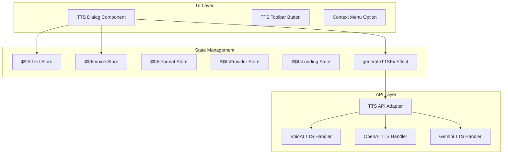
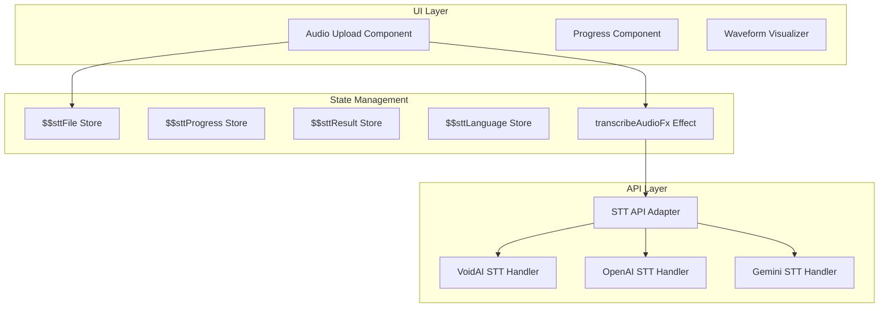
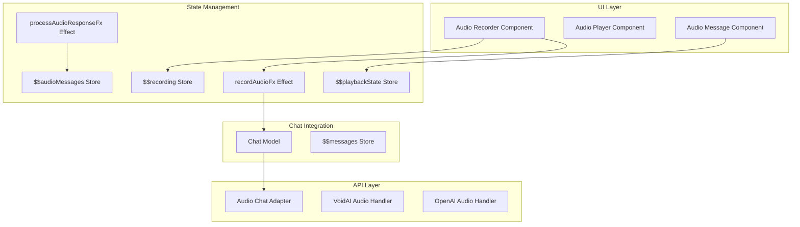
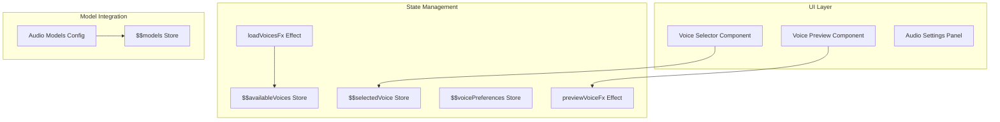
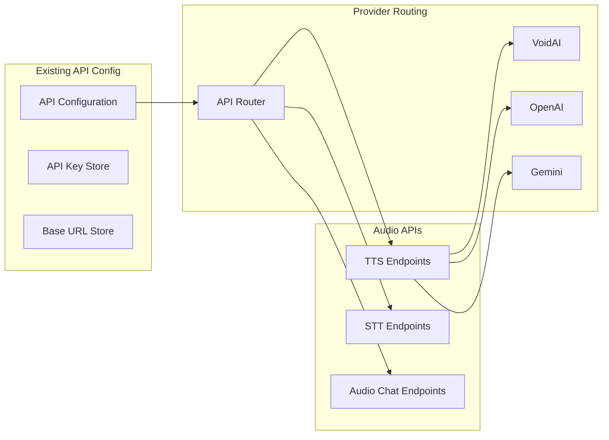

# Audio Features Integration Plan

## 1. Introduction and Overview

This document outlines the comprehensive architectural plan for integrating audio features into our existing chat application. The plan covers four main audio capabilities while maintaining our multi-provider architecture (VoidAI, OpenAI, and Gemini).

### 1.1 Scope

The audio integration will add the following features:
1. **Text-to-Speech (TTS)**: Convert user-specified text into downloadable audio files
2. **Speech-to-Text (STT)**: Transcribe uploaded audio files into text
3. **Audio Input/Output**: Support audio messages within chat conversations
4. **Voice Model Selection**: Choose different voice models and configurations

### 1.2 Architecture Principles

- **Feature-based structure**: Each audio feature will be a self-contained module
- **Provider abstraction**: Handle API differences between providers transparently
- **State management**: Use Effector for predictable state updates
- **User-centric design**: Clear UI/UX for audio interactions

## 2. Text-to-Speech (TTS) Feature

### 2.1 User Experience

Users can convert any text to audio through:
- A dedicated TTS dialog accessible via toolbar button
- Text selection with right-click context menu option
- Keyboard shortcut (Ctrl/Cmd + Shift + S)

The TTS dialog will include:
- Text input area (with markdown support preview)
- Voice selector dropdown
- Audio format selector (MP3, WAV, OPUS, etc.)
- Quality/model selector (standard vs HD)
- Preview button to test before downloading
- Download button to save the audio file

### 2.2 Architecture



### 2.3 Provider Capabilities Matrix

| Feature | VoidAI | OpenAI | Gemini |
|---------|---------|---------|---------|
| Voices | alloy, ash, ballad, coral, echo, fable, onyx, nova, sage, shimmer, verse | alloy, echo, fable, nova, shimmer | 30 voices (Zephyr, Puck, etc.) |
| Formats | MP3, OPUS, AAC, FLAC, WAV, PCM | MP3, OPUS, AAC, FLAC, WAV, PCM | WAV (PCM 24kHz) |
| Models | tts-1, tts-1-hd | tts-1, tts-1-hd, gpt-4o-mini-tts | gemini-2.5-flash-preview-tts, gemini-2.5-pro-preview-tts |
| Multi-speaker | No | No | Yes (up to 2 speakers) |
| Style Control | No | Yes (gpt-4o-mini-tts) | Yes (via prompt) |
| Languages | Multiple | Multiple | 24 languages |

### 2.4 State Model

```typescript
// Features/text-to-speech/model.ts structure
interface TTSState {
  text: string
  voice: string
  format: AudioFormat
  model: string
  provider: 'voidai' | 'openai' | 'gemini'
  isLoading: boolean
  error: string | null
  previewUrl: string | null
}

// Events
- textChanged: Update text to convert
- voiceSelected: Change voice option
- formatSelected: Change output format
- generateClicked: Start TTS generation
- downloadRequested: Save audio file
- previewRequested: Play audio preview

// Effects
- generateTTSFx: Call appropriate provider API
- downloadAudioFx: Save audio to file system
- playPreviewFx: Play audio in browser
```

## 3. Speech-to-Text (STT) Feature

### 3.1 User Experience

Users can transcribe audio files through:
- Drag-and-drop audio files onto chat input
- Click attachment button and select audio file
- Paste audio file from clipboard

The transcription process shows:
- Upload progress indicator
- Audio waveform visualization
- Transcription progress bar
- Option to insert transcribed text or create new message
- Language detection indicator

### 3.2 Architecture



### 3.3 Provider Capabilities Matrix

| Feature | VoidAI | OpenAI | Gemini |
|---------|---------|---------|---------|
| Models | Via OpenAI compatibility | whisper-1, gpt-4o-transcribe | Via multimodal input |
| Streaming | No | Yes | No |
| Languages | Multiple | Multiple | Auto-detect |
| Formats | Common audio formats | Common audio formats | Common audio formats |
| Max Size | Provider limits | 25MB | Provider limits |

### 3.4 State Model

```typescript
// Features/speech-to-text/model.ts structure
interface STTState {
  file: File | null
  progress: number
  isTranscribing: boolean
  result: string | null
  language: string | null
  error: string | null
  provider: 'voidai' | 'openai' | 'gemini'
}

// Events
- audioFileDropped: Handle file drop
- transcriptionStarted: Begin transcription
- progressUpdated: Update progress
- transcriptionCompleted: Process result
- insertToChat: Add to current message
- createNewMessage: Create new chat message

// Effects
- transcribeAudioFx: Call STT API
- detectLanguageFx: Identify audio language
- processAudioFileFx: Validate and prepare file
```

## 4. Audio Input/Output in Chat

### 4.1 User Experience

Users can send and receive audio messages:
- **Recording**: Click microphone button to record voice message
- **Playback**: Audio messages show inline player with controls
- **Transcription**: Option to show/hide transcript for audio messages
- **Multi-modal**: Mix text and audio in same conversation

Audio message UI includes:
- Waveform visualization
- Play/pause button
- Progress bar with time
- Speed control (1x, 1.5x, 2x)
- Download button
- Transcript toggle

### 4.2 Architecture



### 4.3 Message Format Extension

```typescript
// Extend existing message type
interface AudioMessage extends Message {
  type: 'audio'
  audio?: {
    url: string
    duration: number
    format: string
    transcript?: string
    waveform?: number[]
  }
}
```

### 4.4 State Model

```typescript
// Features/audio-chat/model.ts structure
interface AudioChatState {
  isRecording: boolean
  recordingDuration: number
  audioBlob: Blob | null
  playbackStates: Record<string, PlaybackState>
  activePlayer: string | null
}

interface PlaybackState {
  isPlaying: boolean
  currentTime: number
  playbackRate: number
}

// Events
- recordingStarted: Begin audio recording
- recordingStopped: End recording
- audioMessageSent: Send audio to chat
- playbackToggled: Play/pause audio
- playbackRateChanged: Change speed
- transcriptToggled: Show/hide transcript

// Effects
- startRecordingFx: Access microphone
- stopRecordingFx: Process recorded audio
- sendAudioMessageFx: Upload and send audio
- generateTranscriptFx: Create transcript for audio
```

## 5. Voice Model Selection

### 5.1 User Experience

Voice selection integrated into:
- Main model selector (filter by audio capability)
- TTS dialog voice dropdown
- Settings page audio preferences
- Quick voice switcher in toolbar

Features:
- Voice preview/sample playback
- Favorite voices
- Voice search/filter
- Provider indicator
- Language support badges

### 5.2 Architecture



### 5.3 Voice Configuration Schema

```typescript
interface VoiceModel {
  id: string
  name: string
  provider: 'voidai' | 'openai' | 'gemini'
  capabilities: {
    tts: boolean
    stt: boolean
    audioChat: boolean
  }
  voices: VoiceOption[]
  languages: string[]
  formats: AudioFormat[]
}

interface VoiceOption {
  id: string
  name: string
  description: string
  previewUrl?: string
  tags: string[] // ['male', 'female', 'neutral', 'warm', 'professional']
}
```

## 6. Integration with Existing Architecture

### 6.1 File Structure

```
src/features/
├── text-to-speech/
│   ├── model.ts          # TTS state management
│   ├── index.ts          # Public API
│   ├── types.ts          # TypeScript types
│   ├── components/
│   │   ├── TTSDialog.tsx
│   │   └── VoiceSelector.tsx
│   └── api/
│       ├── adapter.ts
│       └── providers/
├── speech-to-text/
│   ├── model.ts          # STT state management
│   ├── index.ts
│   ├── types.ts
│   ├── components/
│   │   ├── AudioUpload.tsx
│   │   └── TranscriptionProgress.tsx
│   └── api/
├── audio-chat/
│   ├── model.ts          # Audio chat state
│   ├── index.ts
│   ├── types.ts
│   ├── components/
│   │   ├── AudioRecorder.tsx
│   │   ├── AudioPlayer.tsx
│   │   └── AudioMessage.tsx
│   └── utils/
│       └── audio-processing.ts
└── voice-models/
    ├── model.ts          # Voice model state
    ├── index.ts
    ├── types.ts
    └── config/
        ├── voices.json
        └── providers.json
```

### 6.2 API Integration Points



## 7. Provider-Specific Handling

### 7.1 API Format Differences

**VoidAI (OpenAI-compatible)**:
- TTS: `/v1/audio/speech` endpoint
- STT: `/v1/audio/transcriptions` endpoint
- Audio Chat: `/v1/chat/completions` with audio modality
- Speed parameter: 0.25 to 4.0 (tts-1, tts-1-hd only)
- Instructions parameter: Not supported

**OpenAI**:
- Same endpoints as VoidAI
- Additional models: `gpt-4o-mini-tts`, `gpt-4o-transcribe`
- Speed parameter: Not supported on gpt-4o-mini-tts
- Instructions parameter: Supported on gpt-4o-mini-tts for voice control
- Streaming transcription: Supported

**Gemini**:
- TTS: `/v1beta/models/{model}:generateContent` with audio response
- STT: Multimodal input to chat endpoint
- Requires different request/response format
- Multi-speaker support: Up to 2 speakers
- Audio output: Base64 encoded PCM data (24kHz, 16-bit)
- Voice control: Via natural language prompts

### 7.2 Model-Specific Audio Support Tracking

| Model | Provider | Audio Format | TTS Support | STT Support | Notes |
|-------|----------|--------------|-------------|-------------|-------|
| tts-1 | VoidAI/OpenAI | OpenAI | ✓ | ✗ | Standard quality, low latency |
| tts-1-hd | VoidAI/OpenAI | OpenAI | ✓ | ✗ | High definition audio |
| gpt-4o-mini-tts | OpenAI | OpenAI | ✓ | ✗ | Voice control via instructions |
| gpt-4o-audio-preview | VoidAI/OpenAI | OpenAI | ✓ | ✗ | Audio generation in chat |
| whisper-1 | OpenAI | OpenAI | ✗ | ✓ | Transcription only |
| gpt-4o-transcribe | OpenAI | OpenAI | ✗ | ✓ | Advanced transcription |
| gemini-2.5-flash-preview-tts | Gemini | Gemini | ✓ | ✗ | Multi-speaker support |
| gemini-2.5-pro-preview-tts | Gemini | Gemini | ✓ | ✗ | Higher quality |

### 7.3 Provider Adapter Pattern

```typescript
interface AudioProvider {
  generateSpeech(params: TTSParams): Promise<AudioBlob>
  transcribeAudio(params: STTParams): Promise<Transcript>
  chatWithAudio(params: AudioChatParams): Promise<AudioResponse>
}

// Each provider implements the interface
class VoidAIProvider implements AudioProvider { }
class OpenAIProvider implements AudioProvider { }
class GeminiProvider implements AudioProvider { }
```

## 8. User Interface Changes

### 8.1 Main Chat Interface

```
┌─────────────────────────────────────────────────┐
│ Chat Application                          [🔊][⚙️]│
├─────────────────────────────────────────────────┤
│ Model: [gpt-4-turbo ▼]  Voice: [Nova ▼]        │
├─────────────────────────────────────────────────┤
│                                                 │
│  [Previous messages with audio playback...]     │
│                                                 │
├─────────────────────────────────────────────────┤
│ [📎][🎤] Type a message...              [Send] │
└─────────────────────────────────────────────────┘

Legend:
🔊 - TTS Dialog
🎤 - Audio Recording
📎 - File Upload (including audio)
```

### 8.2 TTS Dialog Design

```
┌─────────────────────────────────────────────────┐
│ Text to Speech                              [X] │
├─────────────────────────────────────────────────┤
│                                                 │
│ Text to convert:                               │
│ ┌─────────────────────────────────────────────┐ │
│ │                                             │ │
│ │ [Multi-line text input area]                │ │
│ │                                             │ │
│ └─────────────────────────────────────────────┘ │
│                                                 │
│ Voice: [Nova ▼]         Format: [MP3 ▼]        │
│ Model: [tts-1-hd ▼]     Provider: [VoidAI ▼]   │
│                                                 │
│ [Preview]                    [Download Audio]   │
└─────────────────────────────────────────────────┘
```

### 8.3 Audio Message Component

```
┌─────────────────────────────────────────────────┐
│ Assistant:                                      │
│ ┌─────────────────────────────────────────────┐ │
│ │ 🔊 Audio Message (0:45)                     │ │
│ │ [▶️] ━━━━━━━━────────────── 0:12/0:45      │ │
│ │ [1x ▼] [📥] [📝 Show transcript]            │ │
│ └─────────────────────────────────────────────┘ │
└─────────────────────────────────────────────────┘
```

## 9. State Management Summary

### 9.1 New Stores

- `$ttsState`: Text-to-speech configuration and status
- `$sttState`: Speech-to-text processing state
- `$audioRecording`: Audio recording state
- `$audioPlayback`: Audio playback states
- `$voiceModels`: Available voice models
- `$audioPreferences`: User audio preferences

### 9.2 Integration with Existing Stores

- Extend `$messages` to support audio message type
- Update `$models` to include audio capabilities
- Enhance `$chatSettings` with audio preferences
- Modify `$uiState` for audio-related dialogs

### 9.3 Key Effects

- `generateTTSFx`: Generate speech from text
- `transcribeAudioFx`: Convert audio to text
- `sendAudioMessageFx`: Send audio in chat
- `processAudioResponseFx`: Handle audio responses
- `loadVoiceModelsFx`: Load available voices

## 10. Implementation Priorities

### Phase 1: Foundation
1. Create audio feature modules structure
2. Implement provider adapter pattern
3. Extend message types for audio support

### Phase 2: TTS Feature
1. Build TTS dialog and UI components
2. Implement TTS state management
3. Add provider-specific TTS handlers

### Phase 3: STT Feature
1. Create audio upload components
2. Implement transcription flow
3. Add progress tracking and visualization

### Phase 4: Audio Chat
1. Build audio recorder component
2. Create audio player with controls
3. Integrate audio messages into chat

### Phase 5: Voice Models
1. Implement voice selection UI
2. Add voice preview functionality
3. Create voice preferences system

## 11. API Request/Response Examples

### 11.1 TTS Request Examples

**VoidAI/OpenAI Format**:
```json
{
  "model": "tts-1-hd",
  "input": "Hello, this is a test.",
  "voice": "nova",
  "response_format": "mp3",
  "speed": 1.0
}
```

**Gemini Format**:
```json
{
  "contents": [{
    "parts": [{
      "text": "Speaker1: Hello!\nSpeaker2: Hi there!"
    }]
  }],
  "generationConfig": {
    "responseModalities": ["AUDIO"],
    "speechConfig": {
      "multiSpeakerVoiceConfig": {
        "speakerVoiceConfigs": [{
          "speaker": "Speaker1",
          "voiceConfig": {
            "prebuiltVoiceConfig": {
              "voiceName": "Puck"
            }
          }
        }, {
          "speaker": "Speaker2",
          "voiceConfig": {
            "prebuiltVoiceConfig": {
              "voiceName": "Kore"
            }
          }
        }]
      }
    }
  }
}
```

### 11.2 Audio Processing Considerations

**Client-Side Processing**:
- Audio recording using MediaRecorder API
- Format conversion using Web Audio API
- Waveform visualization using Canvas API
- Audio playback using HTML5 Audio element

**File Size Limits**:
- VoidAI: Provider-specific limits
- OpenAI: 25MB for transcription
- Gemini: Provider-specific limits
- Client-side chunking for large files

**Browser Compatibility**:
- MediaRecorder: Chrome 47+, Firefox 25+, Safari 14.1+
- Web Audio API: All modern browsers
- getUserMedia: HTTPS required

## 12. Error Handling and Edge Cases

### 12.1 Common Error Scenarios

- **Microphone Permission Denied**: Show clear instructions for enabling
- **Unsupported Audio Format**: Convert client-side or show format requirements
- **API Rate Limits**: Queue requests and show progress
- **Network Interruptions**: Retry with exponential backoff
- **Large File Handling**: Chunk uploads or compress audio

### 12.2 Graceful Degradation

- Fallback to text input if audio recording fails
- Alternative download formats if primary format fails
- Show transcription errors with option to retry
- Cache successful TTS generations for reuse

## 13. Summary

This plan provides a comprehensive architecture for integrating audio features into the chat application while maintaining clean separation of concerns and supporting multiple providers. The phased approach allows incremental implementation while ensuring each feature is fully functional before moving to the next.

Key architectural decisions:
- Feature-based module structure aligns with existing codebase
- Provider adapter pattern handles API differences elegantly
- Model-specific format tracking for VoidAI/OpenAI vs Gemini
- Effector state management ensures predictable updates
- Progressive enhancement maintains app stability
- Clear UI/UX design focuses on user needs

The implementation will extend the existing chat application with powerful audio capabilities while preserving the current architecture and user experience patterns.