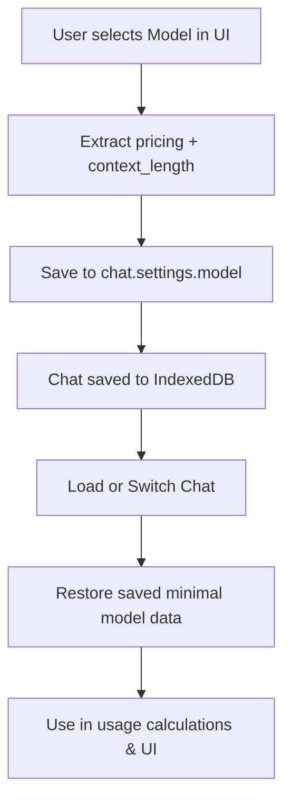

# Updated Architecture Plan: Minimal Model Metadata for Usage Tracking

---

## Context

Revise usage info so that **only essential model parameters needed for accurate tracking** are saved in chat session data and used in calculations:

- **`pricing.prompt`** (cost per 1K prompt tokens)
- **`pricing.completion`** (cost per 1K completion tokens)
- **`context_length`** (max tokens for the model context window)

This eliminates storing redundant or non-critical model metadata, reduces storage footprint, and improves historical accuracy of usage metrics.

---

## 1. **Chat Session Schema**

**Update `ChatSettings` interface (or nested within chat data):**

```typescript
interface ChatSettings {
  model: {
    pricing: {
      prompt: number;
      completion: number;
    };
    context_length: number;
  };
  temperature: number;
  systemPrompt: string;
  // other fields unchanged
}
```

Persist this **minimal model info object** inside `chats[].settings.model`.

---

## 2. **Save Minimal Model Metadata**

### On New Chat Session Creation:

- Extract **`pricing`** and **`context_length`** from the **selected model** (`ModelInfo`) at the moment the session is created.
- Save this minimal object into `chat.settings.model`.

### When User Changes the Model:

- Extract only the required fields.
- Update `chat.settings.model`.
- Save updated chat session to IndexedDB.

---

## 3. **Restore on Session Switch**

- When loading/switching to a saved chat:
  - Restore this minimal object **exactly** as saved.
  - Update UI and calculation stores accordingly.

---

## 4. **Usage Metrics Calculation**

- Calculate **tokens sent** and **tokens received** by analyzing messages array (sum respective tokens).
- Compute **API cost**:

\[
\text{apiCost} = \frac{\text{tokensSent}}{1000} \times \text{pricing.prompt} + \frac{\text{tokensReceived}}{1000} \times \text{pricing.completion}
\]

- Use `context_length` from saved model object for context window usage percent.
- Calculate storage size by measuring serialized chat size and total IDB usage.

---

## 5. **Effector Stores Adjustments**

- Persist minimal model info in chat session data.
- Add/update stores for:
  - Current minimal model metadata (restored from chat session).
  - Usage info leveraging these fields.
- When user changes models, update these stores accordingly.

---

## 6. **Usage Info UI**

- Present metrics in clean sections:

  - **Chat & Model Info:** Chat ID, model name string (from separate source if desired).
  - **Token Usage:** Sent / Received / Total
  - **Context Window:** Used / Max (from saved `context_length`)
  - **API Cost:** Calculated from saved `pricing`
  - **Storage:** Chat size, DB size, quota

- Fix formatting, rounding, and placeholders for missing data.

---

## 7. **Benefits**

- **Historical accuracy** of cost/context values per session.
- **Reduced saved data size**, improving performance.
- No redundant or inconsistent model metadata duplication.
- Simpler implementation focused on what's essential for usage calculations.

---

## Mermaid Diagram: Minimal Metadata Flow



---

## Notes

- **Other model info (name, description, provider, tags) remains accessible elsewhere** and **does not need to be persisted** in chat session data.
- This plan supersedes previous full-object persistence approach, focusing only on data critical for usage/cost.
