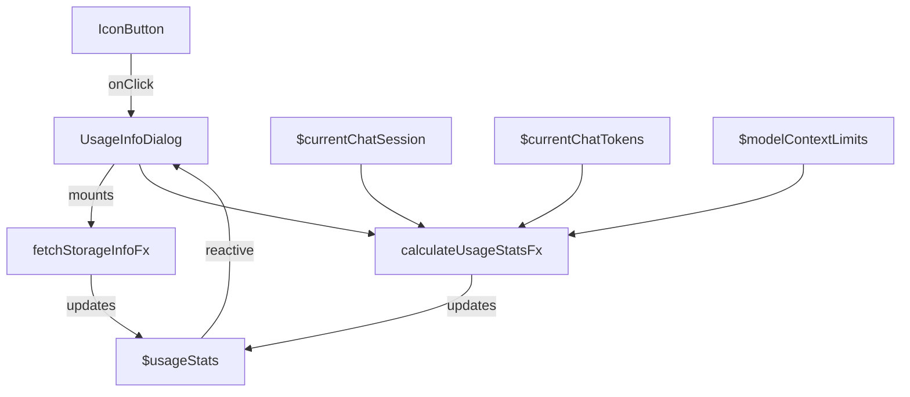

# Usage Info Dialog - Detailed Implementation Plan

---

## Overview

A modular, dynamic Usage Info Dialog to display real-time chat and storage metrics, including:

- Chat ID
- Tokens sent/received
- Context window usage (progress bar)
- API cost
- Storage usage vs quota

---

## 1. Effector Stores and Effects

### Core Stores

- `$currentChatSession`: current chat metadata (ID, model info)
- `$currentChatTokens`: tokens used in current chat
- `$modelContextLimits`: model's max context window
- `$usageStats`: combines all usage info:
  - `tokensSent`
  - `tokensReceived`
  - `contextTokensUsed`
  - `contextTokensMax`
  - `apiCost`
  - `chatSizeMB`
  - `dbSizeMB`
  - `quotaMB`
  - `totalUsageMB`

### Effects

- `fetchStorageInfoFx`

  - Calls `navigator.storage.estimate()`
  - Loads all chat sessions from IDB
  - Calculates:
    - Total DB size
    - Current chat size
  - Updates `$usageStats`

- `calculateUsageStatsFx`
  - Extracts tokens info
  - Fetches model context window
  - Computes API cost
  - Updates `$usageStats`

### Derived Store

- `$contextWindowPercent`
  - `(contextTokensUsed / contextTokensMax) * 100`

---

## 2. Data Flow

- App load or chat change triggers effects
- Dialog open triggers effects
- Effector stores update reactively, UI auto-refreshes

---

## 3. Utility Functions

- `calculateObjectSizeMB(obj)`
- `calculateTotalChatSizeMB(chats)`
- `calculateApiCost(tokensSent, tokensReceived, modelPricing)`
- `formatTokens(num)`
- `formatMB(num)`

---

## 4. UI Integration

- Add icon button to AppBar
- Create `UsageInfoDialog` component

| Section        | Content                             |
| -------------- | ----------------------------------- |
| Chat ID        | `Chat: {id}`                        |
| Tokens         | `Tokens: Sent 12.8k / Received 507` |
| Context Window | Progress bar + `13.3k / 1.0m`       |
| API Cost       | `$0.0000`                           |
| Storage        | `509 kB / {Quota} MB`               |

- Progress bar shows context window usage %

---

## 5. Lifecycle

- On dialog open: trigger effects
- On chat change or message: update tokens, API cost
- On IDB changes: update storage info

---

## 6. Modularity

- Utilities in `utils/storage.ts`
- Effector logic in `features/usage-info/model.ts`
- Dialog UI in `components/UsageInfoDialog.tsx`
- AppBar button in `app/page.tsx`

---

## 7. Architecture Diagram

---

## Summary

- Real-time, modular, dynamic
- Clear UI with progress bar
- Effector-powered updates
- Easy to extend and maintain
