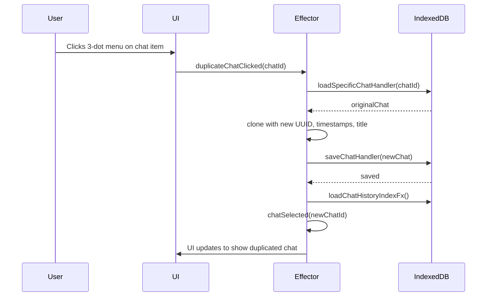

# Chat History Menu & Duplicate Chat Feature Plan

---

## 1. UI Enhancements

- Add a 3-dot menu (`MoreVertIcon`) to each chat item in the chat history list.
- Use MUI `<Menu>` with options:
  - **Rename** (reuse existing inline edit logic)
  - **Duplicate** (new feature)
  - **Delete** (reuse existing delete logic)
- Style menu similar to OpenRouter with icons and Delete in red.

---

## 2. Effector Model Updates

- Add event: `duplicateChatClicked(chatId: string)`
- Add effect: `duplicateChatFx(chatId: string)`
  - Loads original chat via `loadSpecificChatHandler`.
  - Clones chat:
    - New `id: crypto.randomUUID()`
    - `createdAt` and `lastModified` set to `Date.now()`
    - `title` appended with `" (Copy)"` or timestamp.
  - Saves cloned chat via `saveChatHandler`.
  - Refreshes chat list (`loadChatHistoryIndexFx`).
  - Selects duplicated chat (`chatSelected(newId)`).

---

## 3. Data Flow

---

## 4. Additional Details

- Use `crypto.randomUUID()` for new chat IDs (consistent with existing code).
- Auto-select the duplicated chat after creation.
- Existing rename and delete logic remain unchanged.
- Optionally, show a notification "Chat duplicated" after success.

---
