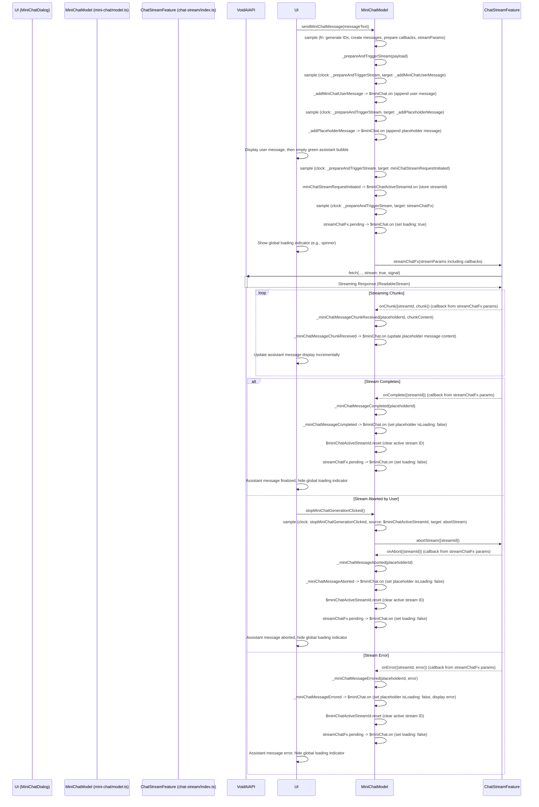

# Detailed Plan: Fixing Mini Chat Streaming

## 1. Goal Recap

Enable robust streaming functionality in the Mini Chat component, ensuring user
messages are displayed, assistant placeholders appear, content streams in, and
network requests are correctly initiated and managed.

## 2. Proposed Changes (`src/features/mini-chat/model.ts`)

### 2.1. Introduce `_addMiniChatUserMessage` Event and Handler

This event will be responsible for adding the user's message to the `$miniChat`
store, ensuring it appears in the UI immediately.

- **Define event:**

  ```typescript
  // Around line 160, with other events
  export const _addMiniChatUserMessage = createEvent<MiniChatMessage>(
    'addMiniChatUserMessage',
  );
  ```

- **Add handler to `$miniChat` store:** Modify the `$miniChat` store definition
  to react to this new event. Also, move the input clearing and compact state
  update here, as they should happen when the user actually sends their message.

  ```typescript
  // Inside $miniChat.on(miniChatOpened...) chain, around line 201
  .on(updateMiniChatInput, (state, input) => ({
      ...state,
      input,
  }))
  .on(_addMiniChatUserMessage, (state, userMessage) => ({ // ADD THIS BLOCK
      ...state,
      messages: [...state.messages, userMessage],
      isCompact: false, // Expand on send
      input: "", // Clear input
  }));
  ```

### 2.2. Adjust `_addPlaceholderMessage` Handler

Since input clearing and compact state updates are moved to
`_addMiniChatUserMessage`, remove them from `_addPlaceholderMessage`.

- **Modify `$miniChat.on(_addPlaceholderMessage, ...)`:**
  ```typescript
  // Around line 323
  const _addPlaceholderMessage = createEvent<MiniChatMessage>();
  $miniChat.on(_addPlaceholderMessage, (state, placeholder) => ({
    ...state,
    // isCompact: false, // REMOVE THIS LINE
    // input: "", // REMOVE THIS LINE
    messages: [...state.messages, placeholder],
    // loading: true, // This comment is correct, loading is now driven by pending
  }));
  ```

### 2.3. Refactor Message Sending Logic for Sequential Execution

The current `split` mechanism handles branches concurrently. To ensure the user
message is added, then the placeholder, then the API call is made, we will
remove the `split` and chain `sample`s.

- **Remove `triggerMiniChatStream` event and the entire `split` block (lines
  337-364).**

- **Create a new internal event to prepare and trigger the stream payload:**
  This event will carry all the necessary data to subsequent steps.

  ```typescript
  // Above the sendMiniChatMessage sample, around line 340
  type PrepareStreamPayload = {
    streamParams: StreamChatParams;
    streamId: string;
    placeholderMessage: MiniChatMessage;
    userMessage: MiniChatMessage;
  };

  const _prepareAndTriggerStream = createEvent<PrepareStreamPayload>(
    'prepareAndTriggerMiniChatStream',
  );
  ```

- **Modify `sendMiniChatMessage`'s `sample`:** This `sample` will now target the
  new `_prepareAndTriggerStream` event.

  ```typescript
  // Replace the existing sample for sendMiniChatMessage, around line 367
  sample({
    clock: sendMiniChatMessage, // User triggers this event with the text content
    source: {
      apiKey: $apiKey,
      model: $miniChatModelId,
      currentMessages: $miniChat.map((s) => s.messages), // Get current messages *before* user message is added to state
    },
    filter: ({ apiKey }) => !!apiKey,
    fn: (
      { apiKey, model, currentMessages },
      messageText,
    ): PrepareStreamPayload => {
      // Specify return type
      // 1. Generate IDs
      const streamId = crypto.randomUUID();
      const placeholderId = crypto.randomUUID();

      // 2. Create User and Placeholder Messages
      const userMessage: MiniChatMessage = {
        role: 'user',
        content: messageText,
      };
      const placeholderMessage: MiniChatMessage = {
        id: placeholderId, // Assign ID to placeholder
        role: 'assistant',
        content: '',
        isLoading: true,
      };

      // Prepare history for API - MUST include the new user message
      const messagesForApi = [...currentMessages, userMessage];

      // 3. Define Callbacks (these remain largely the same)
      const onChunk = ({ chunk }: StreamChunkPayload) => {
        const content = chunk.choices[0]?.delta?.content;
        if (content) {
          _miniChatMessageChunkReceived({
            placeholderId,
            chunkContent: content,
          });
        }
      };
      const onComplete = () => {
        _miniChatMessageCompleted({ placeholderId });
        triggerMiniChatScroll(); // Scroll on completion
      };
      const onError = ({ error }: StreamErrorPayload) => {
        console.error(`[MiniChat Stream ${streamId}] Error:`, error);
        _miniChatMessageErrored({ placeholderId, error });
      };
      const onAbort = () => {
        console.log(`[MiniChat Stream ${streamId}] Aborted.`);
        _miniChatMessageAborted({ placeholderId });
      };

      // 4. Prepare StreamChatParams
      const streamParams: StreamChatParams = {
        streamId,
        model,
        messages: messagesForApi, // Pass history including the new user message
        apiKey,
        // temperature, systemPrompt could be added from settings if needed
        onChunk,
        onComplete,
        onError,
        onAbort,
      };

      // 5. Return all necessary pieces for the next steps
      return { streamParams, streamId, placeholderMessage, userMessage };
    },
    target: _prepareAndTriggerStream, // Target the new event
  });
  ```

- **Chain `sample`s to orchestrate sequential updates and API call:** These
  samples will react to `_prepareAndTriggerStream` and trigger subsequent
  actions in the correct order.

  ```typescript
  // After the sendMiniChatMessage sample, where the old split used to be.
  // Order of these samples determines the flow:

  // 1. Add user message to UI state
  sample({
    clock: _prepareAndTriggerStream,
    target: _addMiniChatUserMessage.prepend((p) => p.userMessage),
  });

  // 2. Add placeholder message to UI state
  sample({
    clock: _prepareAndTriggerStream,
    target: _addPlaceholderMessage.prepend((p) => p.placeholderMessage),
  });

  // 3. Notify about stream initiation (for activeStreamId)
  sample({
    clock: _prepareAndTriggerStream,
    target: miniChatStreamRequestInitiated.prepend((p) => ({
      streamId: p.streamId,
    })),
  });

  // 4. Finally, trigger the stream effect
  sample({
    clock: _prepareAndTriggerStream,
    target: streamChatFx.prepend((p) => p.streamParams),
  });
  ```

### 2.4. Wire `$miniChat.loading` to `streamChatFx.pending`

This will ensure the global loading state of the Mini Chat accurately reflects
whether a streaming request is in progress.

- **Add `.on` handler to `$miniChat`:**
  ```typescript
  // After $miniChat store definition, around line 212
  $miniChat
    .on(miniChatOpened, ...)
    // ... (other .on handlers) ...
    .reset(resetMiniChat)
    .on(streamChatFx.pending, (state, pending) => ({ // ADD THIS BLOCK
        ...state,
        loading: pending,
    }));
  ```

## 3. Mermaid Diagrams

### 3.1. Sequence Diagram: Mini Chat Streaming Flow (Corrected)


