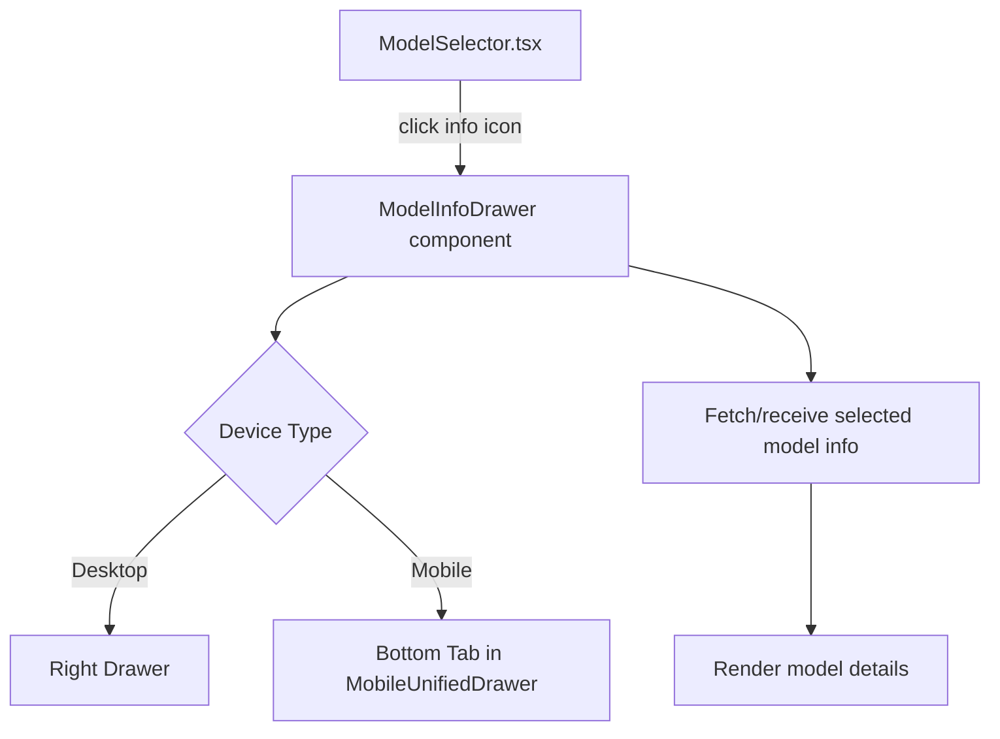

# Model Info Drawer/Tab Feature Plan

---

## Context Summary

- **Model data** already contains:
  - `id`, `name`, `description`
  - `created` timestamp (epoch seconds)
  - `context_length`
  - `pricing` (all prices as strings, `"0"` means free)
- **UI components:**
  - `ModelSelector.tsx` — model dropdown button and menu
  - `MobileUnifiedDrawer.tsx` — existing drawer/tab component for mobile
- **Goal:** Add an info icon near the model selector, which opens a drawer/tab showing detailed model info similar to OpenRouter's UI.

---

## Implementation Plan

### 1. Model Data Enhancements

- **Free status:**

  - Determine if a model is free by checking if **both** `pricing.prompt` and `pricing.completion` are `"0"` or `$0/M`.
  - Alternatively, add a derived boolean `isFree` in the UI layer.

- **Date formatting:**
  - Convert `created` epoch seconds to a human-readable date string (e.g., `"Apr 5, 2025"`).

---

### 2. UI/UX Design

#### Desktop

- Add an **info icon button** next to the model selector `<Button>` in `ModelSelector.tsx`.
- Clicking the icon **opens a right-side drawer** with model details.

#### Mobile

- Reuse or extend `MobileUnifiedDrawer.tsx`.
- Add a **new tab** (e.g., "Model Info") that shows the same content.

---

### 3. Drawer/Tab Content

Styled similarly to the OpenRouter screenshot:

- **Header:**
  - Model **name** (with gift 🎁 icon if free)
- **Model ID:**
  - Monospace font
  - **Copy button** (clipboard icon)
- **Metadata row:**
  - **Created:** formatted date
  - **Context:** e.g., `512,000 context`
  - **Prices:**
    - `$0/M input tokens` (prompt price)
    - `$0/M output tokens` (completion price)
- **Description:**
  - Paragraph text, human-readable.

---

### 4. Component Architecture

---

### 5. Implementation Steps

1. **Create `ModelInfoDrawer.tsx` component**:

   - Accepts `model: ModelInfo` as prop.
   - Displays all info as per design.
   - Includes copy-to-clipboard functionality.
   - Shows gift icon if free.

2. **Update `ModelSelector.tsx`**:

   - Add an **info icon button** next to the selector button.
   - Clicking it **opens the drawer** with current model info.
   - Manage drawer open/close state.

3. **Desktop drawer**:

   - Use Material UI `<Drawer anchor="right">` or similar.
   - Place `ModelInfoDrawer` inside.

4. **Mobile drawer/tab**:

   - Extend `MobileUnifiedDrawer.tsx` to add a **"Model Info" tab**.
   - Render `ModelInfoDrawer` inside this tab.

5. **Styling**:
   - Match OpenRouter style: monospace for IDs, subtle dividers, icons.
   - Responsive layout.

---

## Summary

- **Minimal data changes** needed (date formatting + free detection).
- **Reuse existing drawer/tab infra** for mobile.
- **Add info icon trigger** near model selector.
- **Create a dedicated component** for model info display.
- **Ensure responsive, user-friendly design.**
