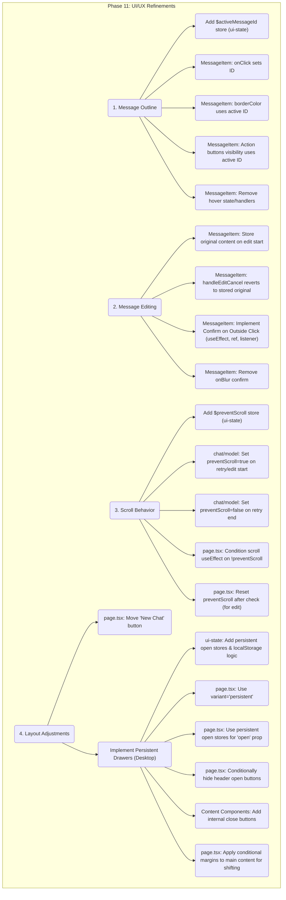

# Phase 11: UI/UX Refinements Plan

**Goals:**

1.  Implement single active message outline on click.
2.  Fix message editing: Confirm on outside click, correct cancel behavior.
3.  Prevent automatic scrolling on message retry and edit confirmation.
4.  Adjust UI layout: Move "New Chat" button, implement persistent History and Settings drawers on desktop.

**Detailed Steps:**

1.  **Message Outline/Active State Management:**
    - **State (`ui-state/model.ts`):** Add `$activeMessageId = createStore<string | null>(null)` store and `setActiveMessageId = createEvent<string | null>()` event. Reset on new chat load (`chatSelected`, `newChatCreated`).
    - **Component (`MessageItem.tsx`):** Use `useUnit` for state/event. Add `onClick` to outer `Paper` to set ID. Update `borderColor` and action button `display` based on `activeMessageId`, removing hover logic.
2.  **Message Editing Enhancements:**
    - **Cancel Revert (`MessageItem.tsx`):** Add state `const [originalContentOnEdit, setOriginalContentOnEdit] = useState<string>('');`. Store `message.content` in it via `handleEditClick`. Update `handleEditCancel` to revert `editedText` to `originalContentOnEdit`.
    - **Confirm on Outside Click (`MessageItem.tsx`):** Add `useRef` to outer `Paper`. Remove `onBlur` from `InputBase`. Add `useEffect` hook with `mousedown` listener to call `handleEditConfirm` if click is outside the `messageItemRef.current`.
    - **Effector Model (`chat/model.ts`):** Verify `editMessage` is only triggered by `handleEditConfirm`.
3.  **Scroll Behavior Fixes:**
    - **State (`ui-state/model.ts`):** Add `$preventScroll = createStore<boolean>(false)` store and `setPreventScroll = createEvent<boolean>()` event.
    - **Retry Flow (`chat/model.ts`):** Use `sample` to trigger `setPreventScroll(true)` before retry API call and `setPreventScroll(false)` after retry API call finishes (using `sendApiRequestFx.finally`). Reset `$retryingMessageId`.
    - **Edit Flow (`chat/model.ts`):** Use `sample` to trigger `setPreventScroll(true)` on `editMessage`.
    - **Scroll Logic (`page.tsx`):** Get `$preventScroll` via `useUnit`. Modify scroll `useEffect`: check `!preventScroll` before scrolling. Reset `preventScroll` to `false` within the effect if it was true (to handle edit flow). Add `preventScroll` to dependencies. Import `setPreventScroll` event.
4.  **UI Layout Adjustments:**
    - **"New Chat" Button (`page.tsx`):** Move the `AddCommentIcon` `IconButton` block to be right after the `HistoryIcon` `IconButton`. Adjust spacing.
    - **Persistent Drawers (Desktop - `page.tsx` & `ui-state/model.ts`):**
      - Add persistent open state stores (`$isHistoryDrawerPersistentOpen`, `$isSettingsDrawerPersistentOpen`) and localStorage load/save logic in `ui-state`.
      - Update drawer toggle/open/close events to use these persistent stores.
      - Change Drawer `variant` to `"persistent"` in `page.tsx`. Use persistent stores for `open` prop.
      - Conditionally hide header open buttons based on persistent open state.
      - Add close buttons inside `ChatHistoryContent.tsx` and `ChatSettingsContent.tsx`.
      - Apply conditional `marginLeft`/`marginRight` with transitions to the main content wrapper in `page.tsx` based on persistent drawer open states. Define drawer width constants.

**Mermaid Diagram:**

