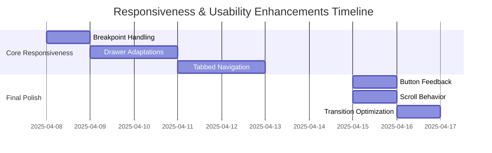

# Detailed Implementation Plan: Responsiveness & Usability Enhancements

## 1. Responsive Layout Improvements

### Key Tasks:

- **Breakpoint Handling**:

  - Modify `src/theme.ts` to add custom breakpoints matching MUI defaults
  - Create responsive hooks in `src/features/ui-state/model.ts`

- **Drawer Adaptations**:
  - Update drawer components to adapt between desktop and mobile views
  - Implement tabbed navigation for mobile drawers

### Files to Modify:

- `src/theme.ts`
- `src/features/ui-state/model.ts`
- `src/components/ChatHistoryDrawer.tsx`
- `src/components/ChatSettingsDrawer.tsx`
- New: `src/components/MobileDrawerTabs.tsx`

## 2. Navigation & Drawer Usability

### Key Tasks:

- **Icon Button Improvements**:
  - Add tooltips and active states to header buttons
- **Drawer Animations**:
  - Implement smooth transitions for drawer operations

## 3. Message Interaction Polish

### Key Tasks:

- **Hover/Tap Feedback**:
  - Enhance message action buttons with subtle animations
- **Inline Editing UX**:
  - Improve edit mode with clear confirm/cancel controls

## 4. Error Display Enhancements

### Key Tasks:

- **Alert Styling**:
  - Create custom alert component with animations
- **Critical Error Dialog**:
  - Implement dedicated error dialog component

## 5. General UI/UX Smoothness

### Key Tasks:

- **Button Feedback**:
  - Enhance button interaction states
- **Scroll Behavior**:
  - Implement smooth scrolling in chat window

## Implementation Timeline

## Risk Assessment

1. **Animation Performance**:
   - Test on low-end devices
2. **Mobile Drawer Behavior**:
   - Thorough cross-browser testing
3. **State Management Complexity**:
   - Keep animations decoupled from business logic
