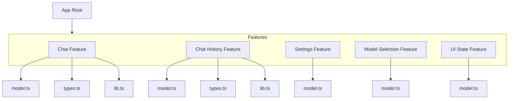

# Project Plan: LLM Chat Interface (v1.1)

**1. Goals Recap:**

- Build a static, responsive React/Next.js web app using TypeScript, MUI, Effector, and fetch API.
- Interface with OpenRouter API for LLM interactions using user-provided keys (stored locally).
- Support multiple chat histories (IndexedDB) with rename/delete/duplicate actions, dynamic model selection with filtering and info display, message editing/deletion/retry, rich message content rendering (Markdown, code, LaTeX, Mermaid), basic settings (LocalStorage), and file attachments (text/image - future).

**2. Core Technologies & Setup:**

- **Framework:** Next.js (App Router)
- **Language:** TypeScript
- **UI:** React, Material UI (MUI) v5+
- **State Management:** Effector, effector-react
- **Data Fetching/Caching:** Effector Effects, fetch API
- **Local Storage:**
  - IndexedDB (via `idb` library) for chat history.
  - LocalStorage for global settings (API Key, default temperature/system prompt, show free models toggle).
- **Rich Content Rendering:**
  - `react-markdown` (Core Markdown)
  - `remark-gfm` (GitHub Flavored Markdown)
  - `react-syntax-highlighter` (Code Syntax Highlighting)
  - `remark-math`, `rehype-katex`, `katex` (LaTeX Math)
  - `@lightenna/react-mermaid-diagram`, `mermaid` (Mermaid Diagrams)
- **Initial Setup:**
  - Initialize Next.js project: `npx create-next-app@latest --ts`
  - Install dependencies: `@mui/material @emotion/react @emotion/styled @mui/icons-material effector effector-react idb react-markdown remark-gfm react-syntax-highlighter remark-math rehype-katex katex @lightenna/react-mermaid-diagram mermaid`
  - Install dev dependencies: `@types/react-syntax-highlighter @types/katex`

**3. Architecture Overview:**

The application will be a client-side Single Page Application (SPA).

---

### Phase 8 Modular Architecture Update

Following Phase 8, the codebase adopts a **feature modularization** approach. Each major domain resides in `/src/features/<feature>/` with consistent internal structure:

- `model.ts` — Effector units (events, effects, stores)
- `types.ts` — TypeScript interfaces, enums
- `lib.ts` — Async effect handlers, pure functions
- `index.ts` — Optional barrel export

This modularization improves maintainability, scalability, and testability by decoupling types and async logic from Effector models.

---



```mermaid
graph TD
    User --> BrowserUI[Browser UI (React/MUI)];
    BrowserUI -- Interacts --> StateMgmt[State Management (Effector)];
    BrowserUI -- Triggers Fetch --> APIInteraction[API Interaction (Effector Effects)];

    StateMgmt -- Updates --> BrowserUI;
    StateMgmt -- Reads/Writes --> LocalPersistence[Local Persistence];
    StateMgmt -- Triggers --> APIInteraction;

    APIInteraction -- Fetches Models --> OpenRouterModels[OpenRouter API /models];
    APIInteraction -- Sends Chat Request --> OpenRouterChat[OpenRouter API /chat/completions];

    LocalPersistence --> IndexedDB[(IndexedDB - Chat History)];
    LocalPersistence --> LocalStorage[(LocalStorage - Settings)];

    subgraph Client-Side Application
        BrowserUI
        StateMgmt
        APIInteraction
        LocalPersistence
    end

    subgraph External Services
        OpenRouterModels
        OpenRouterChat
    end
```

**4. Component Structure:**

```mermaid
graph TD
    App[App Root] --> Layout{Main Layout (Responsive)};

    subgraph Layout
        Header[Header Bar]
        ChatArea[Chat Area]
        InputArea[Message Input Area]
        DesktopDrawers[Desktop Drawers]
        MobileDrawer[Mobile Unified Drawer]
        ErrorDisplay[Error Display (MUI Alert)]
    end

    subgraph Header
        HistoryButton(History Icon Button)
        ModelSelector[Model Selector Button]
        ModelInfoButton(Model Info Icon Button)
        NewChatButton(New Chat Icon Button)
        SettingsButton(Settings Icon Button)
    end

    ChatArea --> MessageList[Scrollable Message List];
    MessageList --> MessageItem[Message Item];
    MessageItem --> MarkdownRenderer[Markdown Renderer]; %% Added Renderer
    MessageItem --> MessageActions[Message Action Icons (Copy, Edit, Delete, Retry)];

    InputArea --> TextInput(Text Input Field);
    InputArea --> AttachButton(Attach File Icon Button)  -- "(Not Implemented)";
    InputArea --> SendButton(Send Icon Button);

    subgraph Desktop Drawers
        LeftDrawer[Left History Drawer]
        RightDrawer[Right Settings Drawer]
        ModelInfoDrawer[Right Model Info Drawer] %% Added Model Info Drawer
    end

    LeftDrawer --> ChatHistoryContent[Chat History Content];
    RightDrawer --> ChatSettingsContent[Chat Settings Content];
    ModelInfoDrawer --> ModelInfoContent[Model Info Content]; %% Content for Model Info

    ChatHistoryContent --> SearchInput(Chat Search Input);
    ChatHistoryContent --> ChatList[Chat List View];
    ChatList --> ChatListItem[Chat List Item (Title, Timestamp)];
    ChatListItem --> ChatListItemMenu[3-Dot Menu (Rename, Duplicate, Delete)]; %% Added Menu

    ChatSettingsContent --> APIKeyInput(API Key Input);
    ChatSettingsContent --> TokenCount(Token Count Display);
    ChatSettingsContent --> TempSlider(Temperature Slider);
    ChatSettingsContent --> SystemPromptInput(System Prompt Input);
    ChatSettingsContent --> FreeModelsToggle(Free Models Toggle Switch); %% Added Toggle

    subgraph Mobile Unified Drawer
        Tabs[Tabs (History, Settings, Model Info)] %% Updated Tabs
        TabPanelHistory[History Panel] --> ChatHistoryContent;
        TabPanelSettings[Settings Panel] --> ChatSettingsContent;
        TabPanelModelInfo[Model Info Panel] --> ModelInfoContent; %% Added Model Info Tab
    end

    %% Interactions
    HistoryButton --> LeftDrawer;
    HistoryButton --> MobileDrawer; %% Opens History Tab
    SettingsButton --> RightDrawer;
    SettingsButton --> MobileDrawer; %% Opens Settings Tab
    ModelInfoButton --> ModelInfoDrawer; %% Opens Model Info Drawer
    ModelInfoButton --> MobileDrawer; %% Opens Model Info Tab
    ModelSelector --> Header;
    ChatListItem -- Click --> App; %% Loads chat
    ChatListItemMenu -- Click --> App; %% Triggers Rename/Duplicate/Delete
    SendButton --> App; %% Triggers send logic
    NewChatButton --> App; %% Triggers new chat logic
    AttachButton --> App; %% Triggers file logic (future)
```

**5. State Management (Effector):**

- **Stores:**
  - `$modelsList`: Stores the array of models fetched from OpenRouter.
  - `$currentChatSession`: Holds the state of the active chat (ID, title, messages array, settings). (From `chat-history` feature)
  - `$chatHistoryIndex`: An array holding summaries (ID, title, timestamp) of all saved chats. (From `chat-history` feature)
  - `$globalSettings`: Holds API key, default temperature, default system prompt, **`showFreeOnly` boolean**. (From `chat-settings` feature)
  - `$uiState`: Holds UI-related state (e.g., drawer open/closed, loading indicators, current error, **`isModelInfoDrawerOpen` boolean**). (From `ui-state` feature)
  - `$messageText`: Current input field text. (From `chat` feature)
  - `$messages`: Array of messages for the current chat. (From `chat` feature)
  - `$selectedModelId`: ID of the currently selected model. (From `models-select` feature)
  - `$isGenerating`: Boolean indicating if an API request is in progress. (From `chat` feature)
  - `$retryingMessageId`: ID of the message being retried. (From `chat` feature)
- **Events:**
  - `appStarted`: Triggered on initial load. (From `chat-history`)
  - `fetchModels`: Initiates fetching the model list. (From `models-select`)
  - `chatSelected`: Loads a specific chat from history. (From `chat-history`)
  - `newChatCreated`: Clears the current chat state for a new session. (From `chat-history`)
  - `selectModel`: User selects a model from the dropdown. (From `models-select`)
  - `updateSetting`: User changes API key, default temp, system prompt, **show free models toggle**. (From `chat-settings`)
  - `messageTextChanged`: Input field content changes. (From `chat`)
  - `messageSent`: User submits a message. (From `chat`)
  - `editMessage`: User confirms editing a message. (From `chat`)
  - `deleteMessage`: User confirms deleting a message. (From `chat`)
  - `messageRetry`: User clicks retry on a message. (From `chat`)
  - `chatTitleEdited`: User finishes editing a chat title. (From `chat-history`)
  - `deleteChat`: User confirms deleting a chat from history. (From `chat-history`)
  - `duplicateChatClicked`: User clicks "Duplicate" in history menu. **(New)** (From `chat-history`)
  - `attachFile`: User selects a file. (Future)
  - `fileRead`: File content successfully read. (Future)
  - `showError`: An error occurred. (From `ui-state`)
  - `dismissError`: User closes the error dialog. (From `ui-state`)
  - `toggleHistoryDrawer`, `toggleSettingsDrawer`, `toggleModelInfoDrawer`. **(Updated)** (From `ui-state`)
- **Effects:**
  - `loadGlobalSettingsFx`: Load settings from LocalStorage. (From `chat-settings`)
  - `saveGlobalSettingsFx`: Save settings to LocalStorage. (From `chat-settings`)
  - `loadChatHistoryIndexFx`: Load chat list/index from IndexedDB. (From `chat-history`)
  - `loadSpecificChatFx`: Load full message history for a selected chat from IndexedDB. (From `chat-history`)
  - `saveChatFx`: Save/update a chat (messages, title, settings) to IndexedDB. (From `chat-history`)
  - `deleteChatFx`: Delete a chat from IndexedDB. (From `chat-history`)
  - `editChatTitleFx`: Update chat title in IndexedDB. (From `chat-history`)
  - `duplicateChatFx`: Load, clone, and save a chat session. **(New)** (From `chat-history`)
  - `fetchModelsFx`: Fetch model list from OpenRouter API. (From `models-select`)
  - `sendApiRequestFx`: Send chat completion request to OpenRouter. (From `chat`)
  - `generateTitleFx`: Send request to OpenRouter to generate chat title. (From `chat`)
  - `readFileFx`: Read file content client-side. (Future)
- **Flow Example (Sending Message):** (Remains the same conceptually, but UI renders markdown)
  ```mermaid
  graph LR
      A[User Clicks Send] --> B(messageSent Event);
      B --> C{Format Request Data};
      C -- Uses --> D1[$currentChatSession Store];
      C -- Uses --> D2[$globalSettings Store];
      C --> E(sendApiRequestFx Effect);
      E -- Sends --> F[OpenRouter API];
      F -- Returns --> E;
      subgraph Effector Logic
          B; C; D1; D2; E; G; H; I; J; K; L; M;
      end
      E -- Success --> G(Update $messages Store - Add User/Assistant Msg);
      E -- Success --> H(Update Token Count in $currentChatSession);
      E -- Failure --> I(showError Event);
      G --> J(saveChatFx Effect);
      J -- Saves --> K[(IndexedDB)];
      I --> L(Update $uiState Store - Show Error);
      L --> M[Error Display (MUI Alert) Component];
  ```

**6. API Interaction (OpenRouter):**

- **Model List:** Use `fetchModelsFx` to fetch `https://openrouter.ai/api/v1/models`. Store in `$modelsList`. Includes pricing and other metadata.
- **Chat Completions:** Use `sendApiRequestFx`. Format messages correctly. Handle token counts.
- **Title Generation:** Use `generateTitleFx`.

**7. Data Persistence:**

- **IndexedDB (`idb` library):**
  - **Store Name:** `chats`
  - **Key:** `id` (UUID string)
  - **Object Structure:** `{ id: string, title: string, createdAt: number, lastModified: number, messages: Message[], settings: { model: string, temperature: number, systemPrompt: string } }` (Message includes role, content, timestamp, isEdited, originalContent).
  - **Index:** `lastModified`.
  - Effects: `loadChatHistoryIndexFx`, `loadSpecificChatFx`, `saveChatFx`, `deleteChatFx`, `editChatTitleFx`, `duplicateChatFx`.
- **LocalStorage:**
  - **Keys:** `openrouter_api_key`, `default_temperature`, `default_system_prompt`, `show_free_only`.
  - Effects: `loadGlobalSettingsFx`, `saveGlobalSettingsFx`.

**8. Key Feature Implementation Notes:**

- **Responsiveness:** Unified mobile drawer with tabs for History, Settings, Model Info. Desktop uses separate drawers.
- **Message Edits/Deletes/Retry:** Handled via Effector events and updates to `$messages` store, persisted via `saveChatFx`.
- **Rich Content Rendering:** `MarkdownRenderer` component handles Markdown, GFM, code syntax highlighting (react-syntax-highlighter), LaTeX (KaTeX), and Mermaid diagrams (@lightenna/react-mermaid-diagram).
- **Model Selection:** Filter by search term and "Show Free Only" toggle. Display cleaned model name.
- **Model Info:** Dedicated drawer/tab showing details of the selected model.
- **Chat History Actions:** 3-dot menu on list items for Rename, Duplicate, Delete. Duplication handled by `duplicateChatFx`.
- **File Attachments:** (Future) Use `<input type="file">`, `FileReader`, check model capabilities.
- **Error Handling:** User-facing errors via MUI Alert components managed by `$uiState.error`.

**9. Development Phasing (Updated):**

1.  **Foundation:** Project setup, MUI theme, basic layout components. **(Complete)**
2.  **Settings:** Settings Drawer UI, LocalStorage persistence. **(Complete)**
3.  **Core Chat:** Basic message sending/display, Effector state. **(Complete)**
4.  **API Integration:** Connect to OpenRouter, handle responses, token count. **(Complete)**
5.  **Model Selection:** Fetch models, Model Selector dropdown UI. **(Complete)**
6.  **History Persistence:** IndexedDB setup, save/load/delete logic, History Drawer UI. **(Complete)**
7.  **Message Actions:** Edit, Delete, Retry logic and UI. **(Complete)**
8.  **Architecture Refactoring:** Feature modularization. **(Complete)**
9.  **Responsiveness & Polish:** Unified mobile drawer, UI/UX improvements. **(Complete)**
10. **Rich Content & Feature Enhancements:** Markdown/Code/LaTeX/Mermaid rendering, Free Model Toggle, Model Info Panel, Chat Duplication. **(Complete)**
11. **File Attachments:** Implement file input, reading, multimodal checks, API updates. **(Next)**
12. **Testing & Refinement:** Unit/integration tests, UI testing, bug fixing. **(Ongoing)**

---
