# Mini-Chat Feature Re-evaluation Analysis

**1. Introduction**

This document provides a detailed analysis of the current "mini-chat" feature implementation. It compares the existing functionality against the requirements outlined in the supervisor's description (including P.S. notes), `PRD.md`, `src/features/mini-chat/INTEGRATION_PLAN.md`, `src/features/mini-chat/PLAN.md`, and `src/features/mini-chat/FRD.md`. The primary goal is to identify gaps, omissions, inconsistencies, and discrepancies, with a particular focus on understanding why the feature currently fails to activate upon text selection.

**2. Methodology**

The analysis involved:

- Reviewing the provided requirements documents.
- Examining the source code for key components and logic within the `src/features/mini-chat/` directory and related integration points (`page.tsx`, `MessageItem.tsx`, `useTextSelection.ts`, `MiniChatToolbar.tsx`, `model.ts`).
- Comparing the implemented code against the specified behaviors and technical notes.

**3. Findings - Core Functionality Analysis**

```mermaid
graph LR
    A[Text Selection] --> B(useTextSelection Hook);
    B --> C{Is Selection Valid?};
    C -- Yes --> D[showMiniChatToolbar Event];
    C -- No --> E[hideMiniChatToolbar Event];
    D --> F($miniChatToolbar Store);
    E --> F;
    F --> G[MiniChatToolbar Component];
    G -- Ask Click --> H{Is miniChat Open?};
    G -- Explain Click --> H;
    H -- No --> I[miniChatOpened Event];
    H -- Yes --> J[updateMiniChatInput / sendMiniChatMessage];
    I --> K($miniChat Store);
    J --> K;
    K --> L[MiniChatDialog Component];
    L -- Expand Click --> M[expandMiniChat Event];
    M --> N[expandMiniChatFx Effect];
    N --> O[saveChatFx Effect];
    L -- Close Click --> P[miniChatClosed Event];
    P --> Q[resetMiniChat / hideMiniChatToolbar];

    style A fill:#f9f,stroke:#333,stroke-width:2px
    style B fill:#ccf,stroke:#333,stroke-width:2px
    style G fill:#ccf,stroke:#333,stroke-width:2px
    style L fill:#ccf,stroke:#333,stroke-width:2px
    style F fill:#fcc,stroke:#333,stroke-width:2px
    style K fill:#fcc,stroke:#333,stroke-width:2px
    style D fill:#cfc,stroke:#333,stroke-width:2px
    style E fill:#cfc,stroke:#333,stroke-width:2px
    style I fill:#cfc,stroke:#333,stroke-width:2px
    style J fill:#cfc,stroke:#333,stroke-width:2px
    style M fill:#cfc,stroke:#333,stroke-width:2px
    style P fill:#cfc,stroke:#333,stroke-width:2px
    style Q fill:#cfc,stroke:#333,stroke-width:2px
    style N fill:#ffc,stroke:#333,stroke-width:2px
    style O fill:#ffc,stroke:#333,stroke-width:2px

    subgraph Feature Implementation
        B; G; L; F; K; D; E; I; J; M; P; Q; N; O; H; C;
    end
```

- **Text Selection & Toolbar Activation:**

  - **Status:** Partially Implemented.
    - The `useMiniChatTextSelection` hook exists and is correctly invoked in `page.tsx`.
    - `MessageItem` components correctly apply the `.chat-message` class.
    - The Effector model (`model.ts`) defines the `$miniChatToolbar` state and events (`show`/`hide`).
    - The `MiniChatToolbar` component subscribes to the state and renders conditionally.
  - **GAP (Critical - Root Cause):** The toolbar **does not appear** on text selection. Despite the code structure appearing correct, the visual feedback is missing. Potential causes:
    1.  **CSS/Positioning:** The toolbar might be rendered but positioned off-screen or hidden by other elements (investigate CSS rules, `z-index`, and calculated `top`/`left` values in DevTools).
    2.  **JS Error:** A subtle error might occur within `useTextSelection.ts`'s `handleSelection` _before_ `showMiniChatToolbar` is called, preventing the state update.
    3.  **Conflicting State:** Another event listener (e.g., scroll listener edge case) might be incorrectly calling `hideMiniChatToolbar` immediately after `showMiniChatToolbar`.
  - **GAP:** Toolbar positioning logic (`useTextSelection.ts:39-40`) relies on `getBoundingClientRect` and scroll offsets, which might be inaccurate in certain complex layouts or scroll scenarios, potentially placing the toolbar incorrectly even if visible.

- **Ask Flow:**

  - **Status:** Partially Implemented.
  - **DISCREPANCY (FRD A2):** When no mini-chat is open, clicking "Ask" _immediately_ triggers `miniChatOpened` (`MiniChatToolbar.tsx:32`), which opens the full dialog. This deviates from the requirement to first show an _inline input_ field and only open the dialog upon submitting from that field.
  - **Alignment (P.S./FRD A4.1):** When a mini-chat _is_ open, clicking "Ask" correctly pastes the selected text into the existing mini-chat input via `updateMiniChatInput` (`MiniChatToolbar.tsx:30`) without sending automatically.

- **Explain Flow:**

  - **Status:** Partially Implemented.
  - **Alignment (FRD A3):** When no mini-chat is open, clicking "Explain" correctly opens the dialog (`miniChatOpened`) and sends the prefixed prompt (`sendMiniChatMessage`) (`MiniChatToolbar.tsx:43-44`).
  - **DISCREPANCY (P.S./FRD A4.2):** When a mini-chat _is_ open, the implementation calls `updateMiniChatInput("")` _before_ `sendMiniChatMessage(explainPrompt)` (`MiniChatToolbar.tsx:40-41`). This clears the input unnecessarily and doesn't align with the requirement to simply send the prefixed explanation prompt into the ongoing chat.

- **Mini Chat Panel (Dialog):**

  - **Status:** Component (`MiniChatDialog.tsx`) exists and is rendered globally (`page.tsx:668`). Assumed partially functional based on Effector model wiring.
  - **GAP (Verification Needed):** Requires inspection of `MiniChatDialog.tsx` to confirm implementation of draggability (e.g., using `react-draggable`) and the minimal UI specified.

- **Temporary Data / Ephemeral State:**

  - **Status:** Implemented. The `$miniChat` store in `model.ts` holds the transient state (input, messages). Logic exists to reset this state upon closing (`miniChatClosed` watcher, `resetMiniChat` event) or expanding (`expandMiniChatFx`).

- **Expand to Full Chat:**

  - **Status:** Partially Implemented. The `expandMiniChat` event triggers `expandMiniChatFx` (`model.ts:147-181`), which formats the mini-chat messages and calls `saveChatFx` (imported from `chat-history/model`).
  - **GAP (Verification Needed):** Needs confirmation that `saveChatFx` correctly creates a _new_, separate chat session in IndexedDB and that the title generation mechanism (mentioned as triggered later in comments) works as expected for these expanded chats.

- **Singleton Behavior:**
  - **Status:** Attempted. Logic in `MiniChatToolbar.tsx` (lines 29, 39) and `model.ts` (line 84) checks `miniChat.isOpen` to modify behavior.
  - **GAP (Verification Needed):** Requires thorough testing to ensure only one mini-chat instance can be visually and functionally active at any given time, covering various edge cases (e.g., rapid selections, interactions while loading).

**4. Findings - Other Requirements Analysis**

- **Assistant Model Selector (Settings):**

  - **Status:** Likely Implemented. `model.ts` imports `$selectedModelId` and uses it when preparing the API call (`sendMiniChatMessageFx`).
  - **GAP (Verification Needed):** Requires checking the Settings UI component to confirm the selector exists and checking `api.ts` to ensure the selected model ID is correctly passed to the backend/OpenRouter.

- **API Endpoint (`/api/assistant`):**

  - **Status:** Partially Implemented. `model.ts` defines `sendMiniChatMessageFx` which calls `sendAssistantMessage` imported from `./api`.
  - **GAP (Verification Needed):** Requires review of `src/features/mini-chat/api.ts` to confirm the implementation details, connection to the LLM provider (OpenRouter), and error/latency handling.

- **Technical Notes Compliance:**
  - **Folder Structure:** Code is correctly located in `src/features/mini-chat/`. (Verified)
  - **`react-draggable`:** Needs check in `MiniChatDialog.tsx`. (Verification Needed)
  - **State Isolation:** Effector model appears well-isolated. (Verified)
  - **Persistence:** Ephemeral state handled; expand saves via `saveChatFx`. (Verified Structure)

**5. Summary of Gaps & Discrepancies**

1.  **CRITICAL: Toolbar Not Appearing:** The primary blocker. Feature is unusable as the entry point (toolbar) doesn't show up.
2.  **Ask Flow Discrepancy:** Initial "Ask" click opens the dialog directly instead of an inline input first.
3.  **Explain Flow Discrepancy:** When chat is open, "Explain" clears input before sending, instead of just sending the prompt.
4.  **Verification Needed:** Draggability (`MiniChatDialog`), API implementation (`api.ts`), Expand persistence details (`saveChatFx`), Singleton robustness, Settings integration.

**6. Recommendations**

1.  **Immediate Debugging (Toolbar Visibility):**
    - Use browser developer tools to inspect the DOM during text selection. Check if the `MiniChatToolbar` Paper element exists.
    - Examine its CSS properties (position, z-index, visibility, display).
    - Add console logs within `useTextSelection.ts` (before calling `showMiniChatToolbar`) and within the Effector model's `.on(showMiniChatToolbar, ...)` handler to trace the event flow and state updates.
2.  **Fix Ask Flow:** Modify `MiniChatToolbar.tsx` `handleAsk` function. When `!miniChat.isOpen`, trigger a new state/component for an inline input instead of calling `miniChatOpened` directly. The submission from this inline input should then call `miniChatOpened` and `sendMiniChatMessage`.
3.  **Fix Explain Flow:** Modify `MiniChatToolbar.tsx` `handleExplain` function. When `miniChat.isOpen`, remove the `updateMiniChatInput("")` call and directly call `sendMiniChatMessage(explainPrompt)`.
4.  **Code Review & Verification:**
    - Review `MiniChatDialog.tsx` for `react-draggable` usage and UI elements.
    - Review `api.ts` for correct API call structure, model parameter usage, and error handling.
    - Review `chat-history/model.ts` (`saveChatFx`) to confirm new session creation logic for expand.
5.  **Testing:** Implement specific tests (unit/integration) for singleton behavior, expand flow, and edge cases around selection/deselection while the mini-chat is active or loading.

**7. Conclusion**

The foundational components and state management for the mini-chat feature are largely in place, following the integration plan. However, a critical bug prevents the feature's activation (toolbar visibility), and several functional discrepancies exist compared to the detailed requirements (Ask/Explain flows). Further debugging is required for the visibility issue, along with targeted code changes to align the Ask/Explain flows with the specification. Verification of related components (Dialog, API, Expand persistence) is also necessary.
