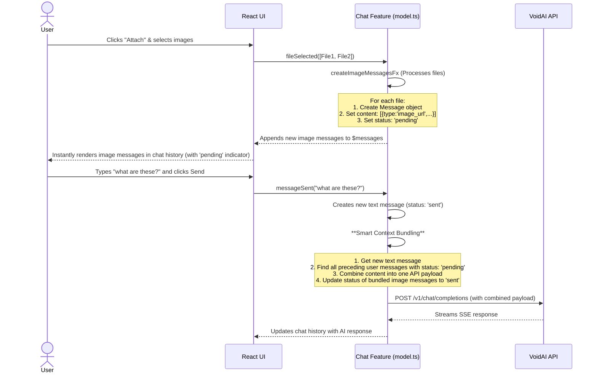

# Refined Multimodal Integration Plan: Images as First-Class Messages

## 1. Executive Summary

This document outlines a refined, comprehensive plan to re-architect the application's multimodal capabilities. The previous implementation, based on a "pending attachments" model, proved to be buggy and provided a suboptimal user experience. This plan addresses these shortcomings by moving to a more robust and intuitive architecture where images are treated as "first-class messages" within the chat history.

The core of this plan involves three major changes:

1.  **Architectural Shift:** We will completely discard the "pending attachments" logic. Instead, when a user selects images, they will be immediately processed and added to the chat history as distinct, user-owned messages.
2.  **Explicit Send Actions:** Image messages will initially be added to the history in a "pending" state. They will **not** be sent to the VoidAI API automatically. The API call will only be triggered when the user explicitly sends a subsequent text message, which will bundle the text and any preceding pending images. This gives the user full control over when to engage the AI.
3.  **Smart Context Bundling:** A new mechanism will intelligently group a user's text message with any contiguous, preceding "pending" image messages into a single, multimodal request to the VoidAI API, ensuring the model receives the full context.

This refined approach will fix all reported bugs (inability to upload multiple photos, images not being sent, images not appearing in history) and deliver a superior, more predictable user experience.

## 2. Problem Analysis & Root Cause

A thorough analysis of the existing implementation revealed the following:

- **Inability to Upload Multiple Photos:** Caused by a hardcoded `multiple={false}` attribute on the file input element in `src/components/ImageAttachmentInput.tsx`.
- **Images Not Sent to API / Displayed in History:** A critical race condition in `src/features/chat/model.ts` where the `$pendingAttachments` store was being reset by the `messageSent` event _before_ the message creation logic, also triggered by `messageSent`, could read the attachment data.

The "pending attachments" UX model itself was also identified as a point of friction. The new "first-class message" architecture directly resolves these fundamental issues.

## 3. Proposed Architecture & Data Flow

The new architecture is centered around the concept of messages having a `status` property.

### 3.1. New `Message` Interface

We will enhance the `Message` type in `src/features/chat/types.ts` to include a `status` field:

```typescript
// in src/features/chat/types.ts
export interface Message {
  id: string;
  role: "user" | "assistant" | "system";
  content: string | MessageContentPart[];
  timestamp: number;
  status?: "pending" | "sent" | "error"; // New field
  // other existing fields...
}
```

- `'pending'`: The message (e.g., an uploaded image) is visible in the UI but has not yet been sent to the API.
- `'sent'`: The message has been successfully included in an API request.
- `'error'`: There was an error sending this message.

### 3.2. Refined Data Flow Diagram

This diagram illustrates the new, user-controlled interaction flow.



## 4. Detailed Implementation Plan

### Phase 4.1: State Management & Core Logic (`src/features/chat/model.ts`)

1.  **Update Types:** Modify the `Message` interface in `src/features/chat/types.ts` to include the new `status` field as described in section 3.1.
2.  **Remove Obsolete State:** Delete the `$pendingAttachments` and `$isProcessingFile` stores, and the `attachmentRemoved` and `attachmentCleared` events.
3.  **Refactor `fileSelected` Event:** Change the event to accept a `File[]` array:
    ```typescript
    export const fileSelected = chatDomain.event<File[]>("fileSelected");
    ```
4.  **Create `createImageMessagesFx` Effect:** This new effect will be the heart of the image handling logic.
    - **Signature:** `createEffect<File[], Message[], Error>()`
    - **Handler Logic:**
      - Takes an array of `File` objects.
      - For each file, it performs validation (type, size).
      - It reads the file and converts it to a Base64 `dataUrl`.
      - It constructs a new `Message` object with:
        - `id`: `crypto.randomUUID()`
        - `role`: `'user'`
        - `content`: `[{ type: 'image_url', image_url: { url: dataUrl } }]`
        - `timestamp`: `Date.now()`
        - `status`: `'pending'`
      - It returns an array of these newly created `Message` objects.
5.  **Update `$messages` Store:**
    - The `$messages` store will have a new `.on` handler for `createImageMessagesFx.doneData` that appends the new image messages to its state.
    - It will also need a handler to update the `status` of messages from `'pending'` to `'sent'` when they are included in an API call.
6.  **Implement Smart Context Bundling Logic:**
    - The `sample` triggered by `messageSent` will be completely rewritten.
    - **Trigger:** It will still be clocked by `messageSent`.
    - **Source:** It will source from `$messages` and `$messageText`.
    - **Function (`fn`) Logic:**
      1.  Create the new text `Message` object from the current `$messageText`.
      2.  Get the current state of the `$messages` array.
      3.  Create a `messagesForApi` array.
      4.  Iterate backward through the `$messages` array. Collect all contiguous `Message` objects where `role === 'user'` and `status === 'pending'`.
      5.  Add the new text message to this collection.
      6.  Merge the `content` arrays of all collected messages into a single `content` array.
      7.  Create the final `StreamChatParams` payload with this merged content.
      8.  Create an array of message IDs that were bundled.
      9.  Return both the `streamParams` and the `bundledMessageIds`.
7.  **Create `messagesSentToApi` Event:**
    - Create a new event: `const messagesSentToApi = chatDomain.event<string[]>()`
    - The `sample` from the previous step will target this event with the `bundledMessageIds`.
    - The `$messages` store will listen to `messagesSentToApi` and map over its state, changing the `status` of any message whose ID is in the payload from `'pending'` to `'sent'`.

### Phase 4.2: UI Components

1.  **`src/components/ImageAttachmentInput.tsx`:**

    - Update the `<input type="file">` to include `multiple={true}`.
    - Update the `handleFileChange` function to iterate through `event.target.files`, create a `File[]` array, and pass it to the `fileSelected` event.
    - Remove all UI code related to displaying pending attachment previews and warnings. The component will now only contain the hidden file input and the `IconButton` that triggers it.

2.  **`src/components/MessageItem.tsx`:**

    - **Display Pending State:** The component will check for `message.status === 'pending'`. If true, it should render a visual indicator, such as a small clock icon or a slightly faded appearance, to signify that the message has not yet been sent to the AI.
    - **Conditional Actions:**
      - Add a helper function `isImageOnlyMessage(message: Message): boolean` that checks if the message content is an array containing only `image_url` parts.
      - In the action buttons section, if `isImageOnlyMessage(message)` is true:
        - Do **not** render the "Edit" (`<EditIcon />`) button.
        - Ensure the "Delete" (`<DeleteIcon />`) button is visible and functional. The existing `deleteMessage` event can be used.
      - If `isImageOnlyMessage(message)` is false, render the normal set of actions.

3.  **`src/app/page.tsx`:**
    - The logic in `handleSendButtonClick` will be simplified. It will no longer need to check for pending attachments. It will simply call `messageSent()` if the input text is not empty. The core bundling logic is now fully encapsulated within the Effector model.

## 5. Testing Strategy

1.  **Unit Tests:**
    - Test the `createImageMessagesFx` effect to ensure it correctly transforms `File` objects into `Message` objects with `status: 'pending'`.
    - Test the Smart Context Bundling logic in isolation to verify it correctly collects contiguous pending messages.
    - Test the `$messages` store reducers for correctly appending new messages and updating their `status`.
2.  **Integration Tests:**
    - Test the flow from `fileSelected` event through `createImageMessagesFx` to the `$messages` store updating, ensuring the UI re-renders correctly.
    - Test the flow from `messageSent` event to the Smart Context Bundling logic, ensuring the correct payload is prepared for the `streamChatFx` effect.
3.  **End-to-End (E2E) Tests:**
    - **Scenario 1 (Single Image):** User uploads one image. Verify it appears in the history with a "pending" indicator. User then sends a text message. Intercept the API call and verify the payload contains both the image and the text. Verify the image's "pending" indicator disappears.
    - **Scenario 2 (Multiple Images):** User uploads three images. Verify three messages appear in pending state. User sends text. Verify API payload contains all three images and the text.
    - **Scenario 3 (Interrupted Context):** User uploads an image. Assistant responds. User uploads another image. User sends text. Verify API payload contains only the second image and the new text, not the first one.
    - **Scenario 4 (Delete):** User uploads an image. Verifies it's pending. User deletes the image message. Verify it is removed from history and is not included in the next API call.

## 6. Conclusion

This refined plan provides a clear and robust path to fixing the critical bugs in the multimodal implementation and delivering a vastly improved user experience. By adopting the "first-class message" architecture with explicit, user-driven send actions, we create a system that is more intuitive, predictable, and scalable for future enhancements.
