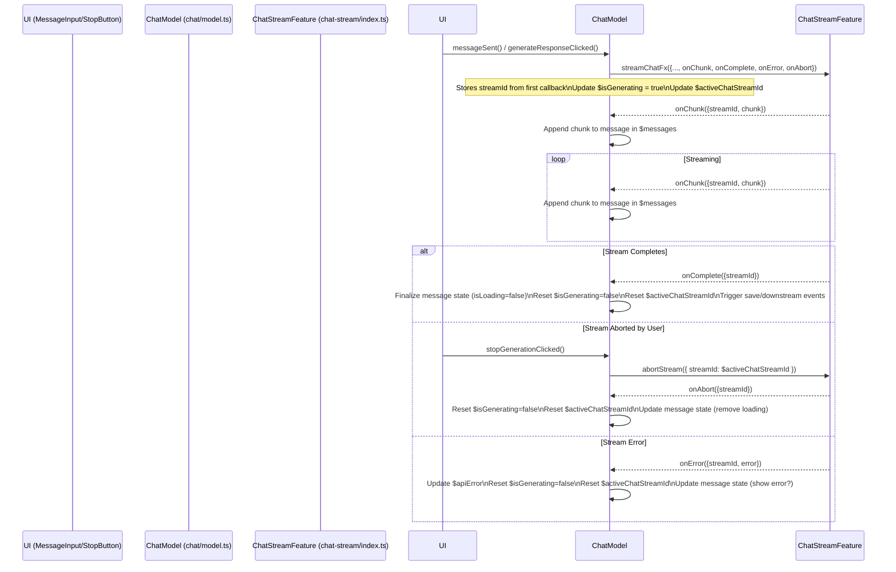

## Plan: Integrating `chat-stream` Feature

**Objective:** Refactor the `chat` and `mini-chat` features to utilize the new `chat-stream` feature for handling API provider communication, enabling real-time streaming responses and cancellation.

**1. Refactor `src/features/chat/model.ts` (Main Chat):**

- **Imports:**
  - Remove imports related to the old `sendApiRequestFx` and `APIResponseBody` if no longer needed elsewhere.
  - Import `streamChatFx`, `abortStream`, and relevant types (e.g., `StreamChatParams`, `StreamChunkPayload`, `StreamCompletePayload`, `StreamErrorPayload`, `StreamAbortPayload`) from `@/features/chat-stream`.
- **State:**
  - Introduce a new store to hold the ID of the currently active stream: `$activeChatStreamId = chatDomain.store<string | null>(null)`.
- **API Call Triggering:**
  - Locate the `sample` blocks that currently target `sendApiRequestFx` (for new messages, retries, and generations).
  - Change the `target` of these `sample` blocks to `streamChatFx`.
  - Modify the `fn` within these `sample` blocks to construct the `StreamChatParams` object required by `streamChatFx`. This includes:
    - Passing the necessary API provider parameters (`model`, `messages`, `temperature`, `apiKey`, etc.).
    - **Crucially, defining the callback functions (`onChunk`, `onComplete`, `onError`, `onAbort`)**. These callbacks will contain the logic to update the chat state.
- **Callback Implementation:**
  - **`onChunk(payload: StreamChunkPayload)`:**
    - Get the current `$messages` state.
    - Identify the target message to update (likely the last assistant message, potentially marked with `isLoading: true` or identified via context passed during the initial `streamChatFx` call if needed, although `streamId` in payload helps confirm).
    - Append `payload.chunk.choices[0]?.delta?.content` to the target message's `content`. Handle null/empty content gracefully.
    - Update the `$messages` store with the modified list.
  - **`onComplete(payload: StreamCompletePayload)`:**
    - Get the current `$messages` state.
    - Find the completed message (using `streamId` context if necessary).
    - Update the message's state (e.g., set `isLoading: false`, potentially update `id` if provided by the final response).
    - Update the `$messages` store.
    - Trigger downstream events previously triggered by `sendApiRequestFx.done` (e.g., `normalResponseProcessed`, `retryUpdate`, `apiRequestTokensUpdated`).
    - Reset `$activeChatStreamId` to `null`.
  - **`onError(payload: StreamErrorPayload)`:**
    - Update the `$apiError` store with `payload.error.message`.
    - Reset `$isGenerating` to `false`.
    - Reset `$activeChatStreamId` to `null`.
    - Optionally update the target message state to reflect the error.
  - **`onAbort(payload: StreamAbortPayload)`:**
    - Reset `$isGenerating` to `false`.
    - Reset `$activeChatStreamId` to `null`.
    - Optionally update the target message state (e.g., remove `isLoading` flag or revert content). _Do not add a cancellation message._
- **Stream ID Management:**
  - Modify the `streamChatFx` handler (or a `sample` listening to its start) to capture the `streamId` generated internally (this requires the effect handler in `chat-stream/model.ts` to somehow return or expose the `streamId` upon start, or pass it to an `onStart` callback if added). Store this ID in `$activeChatStreamId`.
  - _Correction:_ The current `chat-stream` plan passes `streamId` to callbacks. We don't need an `onStart` callback. We can store the `streamId` when the _first_ `onChunk` (or other callback) is received for a new stream request.
- **Cancellation Trigger:**
  - Modify UI component logic (outside `model.ts`) to display a "Stop" button when `$isGenerating` is true.
  - When the "Stop" button is clicked, trigger an event (e.g., `stopGenerationClicked = chatDomain.event()`).
  - Create a `sample` that listens to `stopGenerationClicked`, reads `$activeChatStreamId`, filters if an ID exists, and targets `abortStream` with the `{ streamId }` payload.
- **State Updates:**
  - Update `$isGenerating` based on `streamChatFx.pending`.
  - Ensure `$retryingMessageId` logic is compatible with the new streaming flow (it might need adjustment depending on how placeholders/loading states are handled).
- **Cleanup:**
  - Remove the old `sendApiRequestFx` definition.
  - Remove corresponding logic from `src/features/chat/lib.ts` (e.g., `sendApiRequestFn`) and related types from `src/features/chat/types.ts`.

**2. Refactor `src/features/mini-chat/model.ts` (Mini Chat):**

- **Imports:**
  - Remove imports for `sendAssistantMessage` from `./api`.
  - Remove `sendMiniChatMessageFx`.
  - Import `streamChatFx`, `abortStream`, and relevant types from `@/features/chat-stream`.
- **State:**
  - Introduce `$miniChatActiveStreamId = createStore<string | null>(null)`.
- **API Call Triggering:**
  - Locate the `sample` targeting `sendMiniChatMessageFx`.
  - Change the `target` to `streamChatFx`.
  - Modify the `fn` to construct `StreamChatParams`, including defining callbacks.
- **Callback Implementation:**
  - **`onChunk(payload: StreamChunkPayload)`:**
    - Get current `$miniChat` state.
    - If `messages` is empty or the last message is from the user, add a new placeholder assistant message.
    - Append `payload.chunk.choices[0]?.delta?.content` to the last message's `content`.
    - Update the `$miniChat` store (specifically `messages`).
  - **`onComplete(payload: StreamCompletePayload)`:**
    - Update `$miniChat` store: set `loading: false`.
    - Reset `$miniChatActiveStreamId` to `null`.
  - **`onError(payload: StreamErrorPayload)`:**
    - Update `$miniChat` store: set `loading: false`. Potentially add an error message to the `messages` list.
    - Reset `$miniChatActiveStreamId` to `null`.
  - **`onAbort(payload: StreamAbortPayload)`:**
    - Update `$miniChat` store: set `loading: false`.
    - Reset `$miniChatActiveStreamId` to `null`.
- **Stream ID Management:**
  - Similar to main chat, store the `streamId` from the first callback into `$miniChatActiveStreamId`.
- **Cancellation Trigger:**
  - UI components (e.g., `MiniChatDialog.tsx`) need modification to show a "Stop" button when `$miniChat.loading` is true.
  - Trigger a new event (e.g., `stopMiniChatGenerationClicked`).
  - Add a `sample` listening to this event, reading `$miniChatActiveStreamId`, and targeting `abortStream`.
- **State Updates:**
  - Update `$miniChat.loading` based on `streamChatFx.pending`.
- **Cleanup:**
  - Remove `sendMiniChatMessageFx`.
  - Delete the file `src/features/mini-chat/api.ts`.

**3. UI Considerations (Informational - Implementation in Code Mode):**

- **Incremental Rendering:** Components displaying messages (`MessageItem.tsx`, `MiniChatDialog.tsx`) need to efficiently re-render as content streams in.
- **Stop Button:** Add a "Stop" button (conditionally rendered based on `$isGenerating` / `$miniChat.loading`) that triggers the respective cancellation events. This button should replace the "Generate" button during streaming.
- **Loading Indicators:** Ensure loading indicators (`isLoading` on messages, spinners) are correctly driven by the new streaming state (`streamChatFx.pending`, callback updates).

**4. Sequence Diagram (Integration Example - Main Chat):**

---

This integration plan details the necessary steps to refactor both chat features to use the new streaming module.
