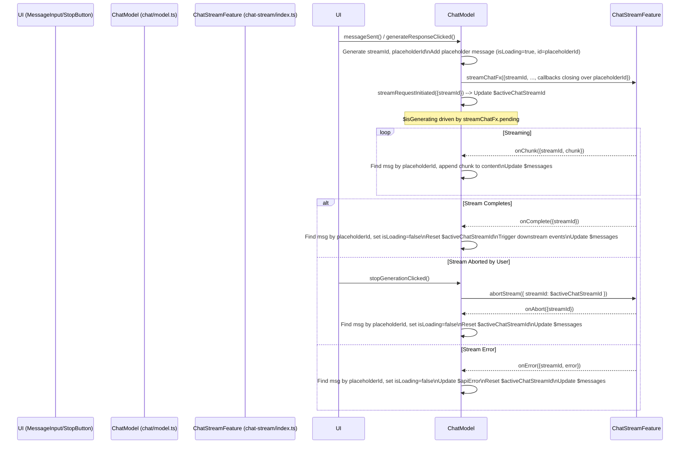

# Integration Plan: Unified Chat Streaming (v1.4)

**Version:** 1.4
**Date:** 2025-04-12
**Author:** Roo (AI Assistant)

## 1. Objective

Refactor the `chat` and `mini-chat` features to utilize the new `chat-stream` feature for handling API provider communication. This enables real-time streaming responses and user-triggered cancellation, while avoiding modifications to core message types by having the consumer generate and manage the stream identifier.

## 2. Pre-requisite: `chat-stream` Feature Modifications

Before integrating, the `chat-stream` feature needs the following adjustments:

1.  **`src/features/chat-stream/types.ts`:**
    - Add `streamId: string;` as a **required** property to the `StreamChatParams` interface.
    - Remove the `onStart?` callback property from `StreamChatParams` (it's no longer needed).
2.  **`src/features/chat-stream/api.ts`:**
    - Update the `fetchChatStream` signature to accept `params: StreamChatParams` (which now includes `streamId`) and `signal: AbortSignal`.
    - Ensure `params.streamId` is used when constructing the payload for all callbacks (`onChunk`, `onComplete`, `onError`, `onAbort`).
3.  **`src/features/chat-stream/model.ts`:**
    - Update the `streamChatFx` handler:
      - It receives `params: StreamChatParams` (including `streamId`).
      - Use `params.streamId` as the key when storing the `AbortController` in the `activeStreams` map.
      - Pass `params` (including `streamId`) down to the `fetchChatStream` function call.
    - The `abortStream` event and its watcher remain unchanged (they operate on `streamId`).

## 3. Refactoring Steps

### 3.1. Refactor `src/features/chat` (Main Chat)

1.  **Imports:**
    - Remove imports related to the old `sendApiRequestFx`, `sendApiRequestFn`, and `APIResponseBody` if no longer used.
    - Import `streamChatFx`, `abortStream`, and types (`StreamChatParams`, `StreamChunkPayload`, etc.) from `@/features/chat-stream`.
2.  **State Management (`model.ts`):**
    - Define a store to hold the ID of the currently active stream for cancellation purposes:
      ```typescript
      const $activeChatStreamId = chatDomain.store<string | null>(null);
      ```
    - Define an event to signal the initiation of a stream request, carrying the generated ID:
      ```typescript
      const streamRequestInitiated = chatDomain.event<{ streamId: string }>();
      ```
    - Update `$activeChatStreamId` when a request starts:
      ```typescript
      $activeChatStreamId.on(
        streamRequestInitiated,
        (_, { streamId }) => streamId
      );
      // Reset will happen within callbacks
      ```
3.  **API Call Triggering (`model.ts`):**
    - Locate the `sample` blocks currently targeting `sendApiRequestFx`.
    - Modify the `fn` within these samples:
      - **Generate `streamId`:** `const streamId = crypto.randomUUID();`
      - **Create Placeholder Message:** Generate a unique `placeholderId` (`crypto.randomUUID()`). Create a `placeholderMessage: Message` object with `id: placeholderId`, `role: 'assistant'`, `content: ''`, `isLoading: true`, `timestamp: Date.now()`. **Do not add `streamId` to the `Message` object itself.**
      - **Add Placeholder:** Trigger an event or update the store (`$messages`) to add the `placeholderMessage` to the list **before** returning the parameters for `streamChatFx`. (This might require using `split` or chaining `sample`s).
      - **Define Callbacks:** Create `onChunk`, `onComplete`, `onError`, `onAbort` functions. These functions will close over the `placeholderId` generated above.
      - **Prepare `StreamChatParams`:** Construct the parameters object for `streamChatFx`, including the **generated `streamId`**.
      - **Return Values:** The `fn` should return an object containing both the `streamParams` for `streamChatFx` and the `streamId` for `streamRequestInitiated`, e.g., `{ streamParams, streamId }`.
    - Modify the `target` of the `sample`: Use Effector patterns (like `split` or separate `sample` calls with `.prepend`) to target `streamChatFx` with `{ streamParams }` and `streamRequestInitiated` with `{ streamId }`.
4.  **Callback Implementation (`model.ts` - inside the `fn` defining params):**
    - **`onChunk = ({ chunk }: StreamChunkPayload) => { ... }`:**
      - Get current `$messages`.
      - Find message index where `msg.id === placeholderId`.
      - If found, create updated message: `content: currentContent + deltaContent`.
      - Update `$messages` state.
    - **`onComplete = () => { ... }`:**
      - Get current `$messages`. Find message index where `msg.id === placeholderId`.
      - If found, create updated message: `isLoading: false`. (Optionally update `id` if final response provides one).
      - Update `$messages` state.
      - Reset `$activeChatStreamId`, `$isGenerating`.
      - Trigger downstream events (saves, etc.).
    - **`onError = ({ error }: StreamErrorPayload) => { ... }`:**
      - Get current `$messages`. Find message index where `msg.id === placeholderId`.
      - If found, create updated message: `isLoading: false`, potentially update content with error info.
      - Update `$messages` state.
      - Update `$apiError`. Reset `$activeChatStreamId`, `$isGenerating`.
    - **`onAbort = () => { ... }`:**
      - Get current `$messages`. Find message index where `msg.id === placeholderId`.
      - If found, create updated message: `isLoading: false`.
      - Update `$messages` state.
      - Reset `$activeChatStreamId`, `$isGenerating`.
5.  **Cancellation Trigger (`model.ts`):**
    - Define `stopGenerationClicked = chatDomain.event<void>()`.
    - Create a `sample`:
      ```typescript
      sample({
        clock: stopGenerationClicked,
        source: $activeChatStreamId,
        filter: (streamId): streamId is string => !!streamId,
        fn: (streamId) => ({ streamId }), // Prepare payload for abortStream
        target: abortStream,
      });
      ```
6.  **State Updates (`model.ts`):**
    - Drive `$isGenerating` using `streamChatFx.pending`.
7.  **Cleanup:**
    - Remove the old `sendApiRequestFx` definition from `model.ts`.
    - Remove `sendApiRequestFn` and related helpers from `lib.ts`.
    - Remove unused types (`APIResponseBody`, etc.) from `types.ts`.

### 3.2. Refactor `src/features/mini-chat`

1.  **Imports (`model.ts`):**
    - Remove imports for `sendAssistantMessage` from `./api`.
    - Remove `sendMiniChatMessageFx`.
    - Import `streamChatFx`, `abortStream`, and types from `@/features/chat-stream`.
2.  **State Management (`model.ts`):**
    - Define `$miniChatActiveStreamId = createStore<string | null>(null)`.
    - Define `miniChatStreamRequestInitiated = createEvent<{ streamId: string }>()`.
    - Update `$miniChatActiveStreamId`:
      ```typescript
      $miniChatActiveStreamId.on(
        miniChatStreamRequestInitiated,
        (_, { streamId }) => streamId
      );
      ```
3.  **API Call Triggering (`model.ts`):**
    - Locate the `sample` targeting `sendMiniChatMessageFx`.
    - Modify the `fn`:
      - **Generate `streamId`:** `const streamId = crypto.randomUUID();`
      - **Create Placeholder Message:** Generate `placeholderId`. Create `placeholderMessage: MiniChatMessage` with `id: placeholderId`, `role: 'assistant'`, `content: ''`, `isLoading: true`.
      - **Add Placeholder:** Update `$miniChat` state to add the `placeholderMessage` to the `messages` array **before** returning params. Set `loading: true`.
      - **Define Callbacks:** Create `onChunk`, `onComplete`, `onError`, `onAbort` closing over `placeholderId`.
      - **Prepare `StreamChatParams`:** Construct params, including the generated `streamId`.
      - **Return:** `{ streamParams, streamId }`.
    - Modify `target` using `split` or separate `sample`s to target `streamChatFx` and `miniChatStreamRequestInitiated`.
4.  **Callback Implementation (`model.ts` - inside the `fn` defining params):**
    - Implement callbacks similar to `chat/model.ts`, but operating on the `$miniChat` store's `messages` array and finding the target message using `placeholderId`. Use `loading` state within `$miniChat` instead of a separate `$isGenerating`.
5.  **Cancellation Trigger (`model.ts`):**
    - Define `stopMiniChatGenerationClicked = createEvent<void>()`.
    - Create a `sample` listening to this event, reading `$miniChatActiveStreamId`, filtering, and targeting `abortStream`.
6.  **State Updates (`model.ts`):**
    - Drive `$miniChat.loading` using `streamChatFx.pending`.
7.  **Cleanup:**
    - Remove `sendMiniChatMessageFx`.
    - Delete the file `src/features/mini-chat/api.ts`.

### 3.3. UI Changes Required (Implementation in Code Mode)

1.  **`src/app/page.tsx`:** Modify the Send/Generate `IconButton` (approx. lines 669-680) to:
    - Conditionally render a "Stop" icon/button when `$isGenerating` is true.
    - The "Stop" button's `onClick` should trigger the `stopGenerationClicked` event from `chat/model.ts`.
    - The original Send/Generate icon/button should be hidden when `$isGenerating` is true.
2.  **`src/features/mini-chat/MiniChatDialog.tsx`:** Modify the Send `IconButton` (approx. lines 236-250) to:
    - Conditionally render a "Stop" icon/button when `$miniChat.loading` is true.
    - The "Stop" button's `onClick` should trigger the `stopMiniChatGenerationClicked` event from `mini-chat/model.ts`.
    - The original Send icon/button should be hidden when `$miniChat.loading` is true.

## 4. Sequence Diagram (Illustrative Example - Main Chat)



## 5. Conclusion

This plan (v1.4) outlines the integration of the `chat-stream` feature using consumer-generated stream IDs. It avoids modifying core message types while providing robust stream handling and cancellation. Careful implementation of placeholder management and callback logic within the consumer models is key.
