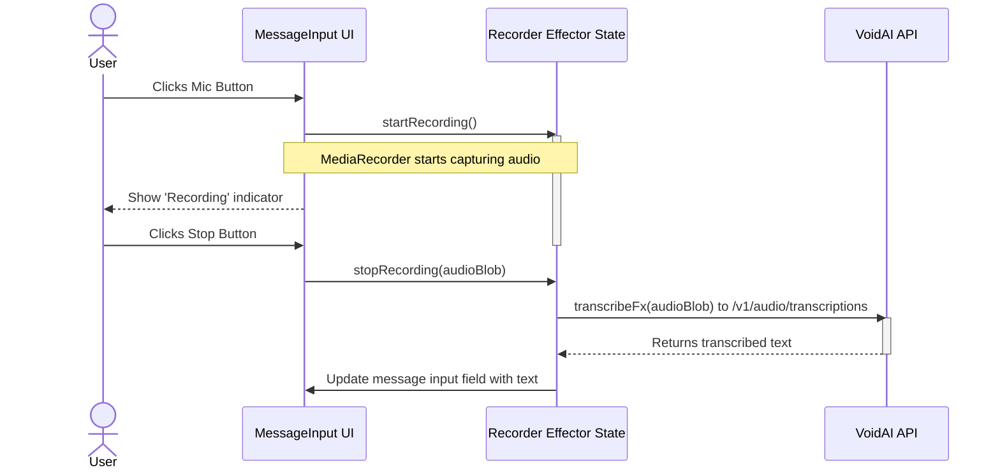
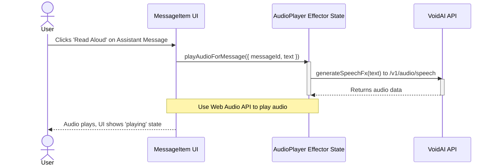

# **Grand Integration Plan: Full VoidAI API Implementation**

## **Vision & Guiding Principles**

- **Phased Rollout:** Implement features in discrete, logical phases to manage complexity and ensure stability.
- **Leverage OpenAI Compatibility:** Continue to assume OpenAI-compatible request/response structures as the baseline, as detailed in the initial research, but validate for each new endpoint.
- **Modular Architecture:** Encapsulate the logic for each new capability (transcription, TTS, image generation) into its own Effector feature or extend existing features logically. This maintains separation of concerns.
- **Seamless UX:** Integrate new functionalities into the existing UI gracefully, using familiar patterns like icon buttons and contextual actions.

---

## **Phase 1: Multimodal Chat with Image Uploads**

This phase will proceed exactly as detailed in the `Multimodal_Chat_Implementation_Plan.md`. The priority is to enable users to attach images to their messages for vision-enabled conversations.

- **Critical First Step (PoC):** Before any other work, execute the Proof-of-Concept spike to validate that VoidAI's `chat.completions` endpoint accepts the OpenAI-style multimodal format (`content: [{type: 'text', ...}, {type: 'image_url', ...}]`).
- **Key Task: Identify Vision Models:** The PoC must identify the correct model ID for vision capabilities. Based on `VoidAI.app.docs.md`, likely candidates include:
  - `gpt-4-1106-vision-preview`
  - `gpt-4o` (and its variants)
  - `grok-2-vision-1212`
  - `pixtral-large-latest`
  - `Qwen/Qwen2.5-VL-72B-Instruct`
- **Implementation:** Follow the detailed plan covering Type Definition updates, Effector state changes for `$pendingAttachment`, and UI modifications for the attach button, preview, and message rendering.

### **Architectural Diagram (Image Upload)**

This diagram, adapted from the provided research, remains the blueprint for this phase.

```mermaid
graph TD
    subgraph User Interface
        A[MessageInput Area] -- 1. Click --> B(Attach File Button);
        B -- 2. Triggers --> C{<input type="file" accept="image/*">};
        C -- 3. User Selects File --> E[UI Handler];
        E -- 4. FileReader API --> F[Base64 Data URL];
        F -- 5. Shows Preview in --> G[Image Preview in Input Area];
    end

    subgraph Effector State (chat feature)
        E -- Fires Event --> H(fileSelected Event);
        H -- Updates --> I[($pendingAttachment Store)];
        J[Send Button Click] -- Fires Event --> K(messageSent Event);
        K -- Reads from --> I;
    end

    subgraph API Call (chat-stream feature)
        K -- Triggers --> M{Construct OpenAI Vision Payload};
        M -- Calls streamChatFx --> P[VoidAI API<br>/v1/chat/completions];
    end

    subgraph Message Rendering
        P -- Streams Response --> Q[MessageItem.tsx];
        Q -- Renders --> R{User Message with Image};
    end
```

---

## **Phase 2: Audio Transcription (Speech-to-Text)**

This phase introduces a "microphone" button in the input area to allow users to speak their messages instead of typing.

- **API Endpoint:** `client.audio.transcriptions.create`
- **Models:** `whisper-1`, `gpt-4o-transcribe`, `gpt-4o-mini-transcribe`
- **Key Implementation Steps:**
  1.  **UI:** Add an `IconButton` with a `<MicIcon />` to the `MessageInput` component. The button's appearance should change to indicate recording status (e.g., idle, recording, processing).
  2.  **State Management (New `recorder` feature):**
      - `$isRecording: Store<boolean>`
      - `$transcript: Store<string>`
      - `startRecording: Event<void>`
      - `stopRecording: Event<void>`
      - `transcribeFx: Effect<Blob, string, Error>`: This effect will take the recorded audio blob, call the VoidAI API, and return the transcribed text.
  3.  **Logic:**
      - Use the browser's `MediaRecorder` API to capture audio.
      - When recording stops, `transcribeFx` is triggered.
      - On `transcribeFx.doneData`, the returned text will populate the main message input field.

### **Architectural Diagram (Audio Transcription)**



---

## **Phase 3: Audio Generation (Text-to-Speech)**

This phase adds a "read aloud" feature to assistant messages, enhancing accessibility and user experience.

- **API Endpoint:** `client.audio.speech.create`
- **Models:** `tts-1`, `tts-1-hd`
- **Key Implementation Steps:**
  1.  **UI:** Add an `IconButton` with a `<VolumeUpIcon />` to the `MessageItem` toolbar for assistant messages.
  2.  **State Management (New `audioPlayer` feature):**
      - `$currentlyPlayingId: Store<string | null>`: Stores the ID of the message being played.
      - `$playbackState: Store<'playing' | 'paused' | 'stopped'>`
      - `playAudioForMessage: Event<{messageId: string, text: string}>`
      - `generateSpeechFx: Effect<string, ArrayBuffer, Error>`: Takes text, calls the VoidAI API, and returns the audio data.
  3.  **Logic:**
      - When the play button is clicked, `generateSpeechFx` is called with the message content.
      - On success, use the browser's `Web Audio API` (`AudioContext`) to decode and play the returned audio buffer.
      - Manage playback state to handle play/pause/stop functionality.

### **Architectural Diagram (Text-to-Speech)**



---

## **Phase 4: Image Generation**

This phase allows users to generate images directly within the chat interface using a text prompt.

- **API Endpoint:** `client.images.generate`
- **Models:** `gpt-image-1`, `dall-e-3`, `dall-e-2`, `imagen-3.0-generate-001`, `FLUX.1` variants.
- **Key Implementation Steps:**
  1.  **UI/UX:**
      - **Option A (Command-based):** Detect a command like `/imagine a photorealistic cat` in the message input.
      - **Option B (Dedicated UI):** Add a new button/mode that opens a specific image generation prompt interface. (Recommend starting with Option A for simplicity).
  2.  **Logic:**
      - When an image generation command is detected, instead of calling the `chat.completions` stream, a new effect (`generateImageFx`) is triggered.
      - This effect calls the `images.generate` endpoint with the user's prompt.
      - On success, the API returns an image URL.
  3.  **Rendering:** A new "assistant" message is created containing the generated image, rendered from the returned URL. We can also include the original prompt as text content in the same message for context.

---

## **Phase 5: General File Uploads (Text Extraction)**

This phase expands the file attachment capability to include common text-based documents, extracting their content to be used as context in the chat.

- **API Endpoint:** `client.chat.completions` (The extracted text is sent as part of the prompt).
- **Key Implementation Steps:**
  1.  **UI:** Update the `<input type="file">` to have a broader `accept` attribute: `"image/*, .md, .txt, .html, .pdf, .docx"`.
  2.  **Client-Side Logic (This is the most complex part):**
      - **Simple Text (`.md`, `.txt`, `.html`):** Use `FileReader.readAsText()` to get the file content directly.
      - **Complex Files (`.pdf`, `.docx`):** This requires adding new, potentially heavy, client-side dependencies.
        - **For PDF:** Integrate a library like **`pdf.js`** (from Mozilla) to parse the PDF and extract text content.
        - **For DOCX:** Integrate a library like **`mammoth.js`** to convert `.docx` content to HTML, from which text can be extracted.
  3.  **Flow:**
      - When a file is selected, determine its type.
      - Use the appropriate method/library to extract the text.
      - Display a preview of the extracted text in the UI.
      - When the message is sent, prepend the extracted text to the user's message content, clearly indicating its source (e.g., `[Content from my_document.pdf]: ...`).
