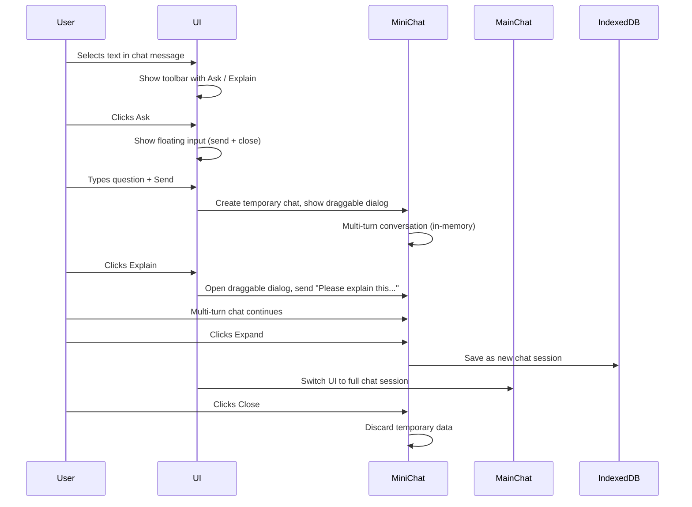

# Feature Requirements Document: Contextual Mini Chat Assistant

**Version:** 1.0  
**Date:** 2025-04-10  
**Author:** doasync  
**Status:** Initial Draft

---

## 1. Introduction

This document outlines the requirements for a **Contextual Mini Chat Assistant** feature. It enables users to select text within chat messages and quickly initiate a lightweight, multi-turn assistant conversation without disrupting their main chat flow. The mini chat is designed to be minimalistic, non-blocking, and easily expandable into a full chat session.

---

## 2. Goals

- Provide contextual, multi-turn mini conversations linked to selected text.
- Enable quick queries or explanations with minimal UI intrusion.
- Allow promotion of mini chat to a persistent, full chat session.
- Support a dedicated assistant model configurable separately from the main chat.
- Maintain clean separation between mini chat and main chat sessions.

---

## 3. User Stories / Use Cases

- _As a user_, when I select any text inside chat messages, I want a toolbar with **Ask** and **Explain** options.
- _As a user_, I want to quickly ask a question about the selected text without leaving my main chat.
- _As a user_, I want the mini chat to be draggable and non-intrusive.
- _As a user_, I want to expand the mini chat into a full chat if the conversation becomes important.
- _As a user_, I want the mini chat to discard its data if I close it without expanding.

---

## 4. Functional Requirements

### 4.1. Text Selection Toolbar

- Appears **only inside chat message area** upon text selection.
- Contains **Ask** and **Explain** buttons.
- Toolbar is positioned contextually below the selection.

### 4.2. Ask Button Flow

- Clicking **Ask** opens a **floating minimal input box** with:
  - Multi-line input
  - **Send** button
  - **Close** button
- On **Send**:
  - A **draggable mini chat dialog** appears at the input's location.
  - Initiates a **new temporary chat session** using the dedicated assistant model.
  - Supports **multi-turn conversation**, no action buttons inside messages.
  - Saves conversation **only in memory** (discarded on close).
  - Displays an **Expand** button to convert to full chat.
  - Displays a **Close** button to discard.

### 4.3. Explain Button Flow

- Immediately opens the **draggable mini chat dialog**.
- Sends a pre-filled message: `"Please explain this to me: {selected text}"`.
- Otherwise identical to Ask mini chat.

### 4.4. Mini Chat Dialog

- Draggable via `react-draggable`.
- Minimalistic, no message actions.
- Parallel to main chat (non-blocking).
- Uses dedicated assistant model.
- **Expand** button:
  - Converts mini chat into a **new full chat session** saved in IndexedDB.
  - Switches UI context to this new chat.
- **Close** button:
  - Discards the temporary mini chat session entirely.

### 4.5. Assistant Model Selector

- Add a **new model selector** in Settings dedicated to the mini chat assistant.
- Configurable independently from the main chat model.
- Defaults to a smaller/faster model optimized for quick contextual help.

---

## 5. UI/UX Requirements

- Toolbar and input should be **minimal, contextual, and non-intrusive**.
- Mini chat dialog is **draggable** and optionally resizable.
- Mini chat supports **multi-turn** but no file uploads or message action buttons.
- Smooth transition from mini chat to full chat on expand.
- Consistent Material UI styling.

---

## 6. Non-Functional Requirements

- Use **Effector** for mini chat state management.
- Use **IndexedDB** only when mini chat is expanded.
- Responsive and performant.
- Compatible with existing app architecture.

---

## 7. Out of Scope

- File attachments in mini chat.
- Saving temporary mini chat data beyond session.
- Toolbar outside chat message area.
- Real-time collaboration inside mini chat.

---

## 8. Integration Points

- Hook into existing chat message rendering for text selection detection.
- Extend Settings UI with new assistant model selector.
- Reuse existing chat rendering components where possible.

---

## 9. Interaction Flow Diagram

---

## 10. Appendix

- Mini chat is designed to be lightweight and quick, optimized for contextual assistance.
- Assistant model can be a smaller, faster LLM for rapid responses.
- Expansion creates a new, independent chat session for deeper exploration.

---
